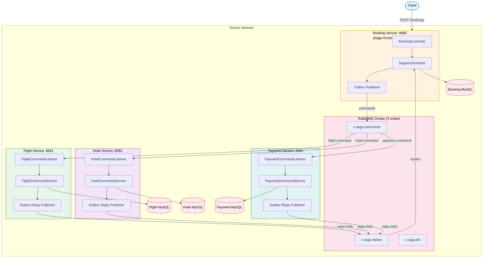
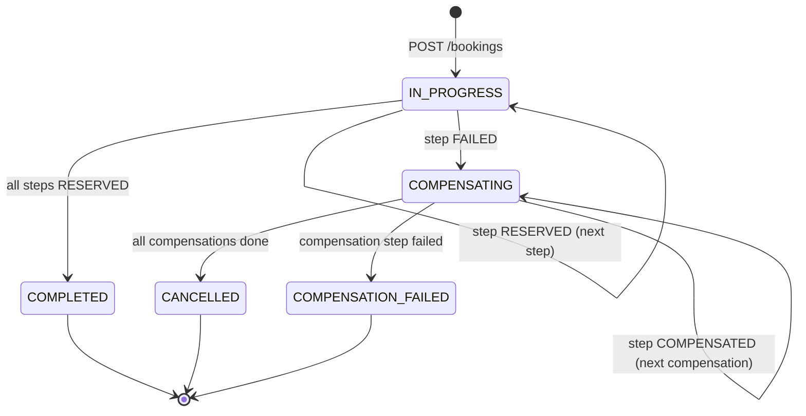

# Distributed Trip Booking System - Saga Orchestration

[](https://spring.io/projects/spring-boot) [![Java](https://img.shields.io/badge/Java-25-ED8B00.svg?logo=data:image/svg+xml;base64,PHN2ZyB4bWxucz0iaHR0cDovL3d3dy53My5vcmcvMjAwMC9zdmciIHZpZXdCb3g9IjAgMCAyNCAyNCIgZmlsbD0id2hpdGUiPjxwYXRoIGQ9Ik04Ljg1MSAxOC41NnMtLjkxNy41MzQuNjUzLjcxNGMxLjkwMi4yMTggMi44NzQuMTg3IDQuOTY5LS4yMTEgMCAwIC41NTIuMzQ2IDEuMzIxLjY0Ni00LjY5OCAyLjAxMy0xMC42MzMtLjExOC02Ljk0My0xLjE0OU04LjI3NiAxNS45MzNzLTEuMDI4Ljc2Mi41NDIuOTI0YzIuMDMyLjIwOSAzLjYzNi4yMjcgNi40MTMtLjMwOCAwIDAgLjM4NC4zODkuOTg3LjYwMi01LjY3OSAxLjY2MS0xMi4wMDcuMTMtNy45NDItMS4yMThNMTMuMTE2IDExLjQ3NWMxLjE1OCAxLjMzMy0uMzA0IDIuNTMzLS4zMDQgMi41MzNzMi45MzktMS41MTggMS41ODktMy40MThjLTEuMjYxLTEuNzcyLTIuMjI4LTIuNjUyIDMuMDA3LTUuNjg4IDAgMC04LjIxNiAyLjA1MS00LjI5MiA2LjU3M00xOS4zMyAyMC41MDRzLjY3OS41NTktLjc0Ny45OTFjLTIuNzEyLjgyMi0xMS4yODggMS4wNjktMTMuNjY5LjAzMy0uODU2LS4zNzMuNzUtLjg5IDEuMjU0LS45OTguNTI3LS4xMTQuODI4LS4wOTMuODI4LS4wOTMtLjk1My0uNjcxLTYuMTU2IDEuMzE3LTIuNjQzIDEuODg3IDkuNTggMS41NTMgMTcuNDYyLS43IDE0Ljk3NS0xLjgyTTkuMjkyIDEzLjIxcy00LjM2MiAxLjAzNi0xLjU0NCAxLjQxMmMxLjE4OS4xNTkgMy41NjEuMTIzIDUuNzctLjA2MiAxLjgwNi0uMTUyIDMuNjE4LS40NzcgMy42MTgtLjQ3N3MtLjYzNy4yNzItMS4wOTguNTg3Yy00LjQyOSAxLjE2NS0xMi45ODYuNjIzLTEwLjUyMi0uNTY5IDIuMDgyLTEuMDA2IDMuNzc2LS44OTEgMy43NzYtLjg5MU0xNy4xMTYgMTcuNTg0YzQuNTAzLTIuMzQgMi40MjEtNC41ODkuOTY4LTQuMjg1LS4zNTUuMDc0LS41MTUuMTM4LS41MTUuMTM4cy4xMzItLjIwNy4zODUtLjI5N2MyLjg3NS0xLjAxMSA1LjA4NiAyLjk4MS0uOTI5IDQuNTYyIDAgMCAuMDctLjA2Mi4wOTEtLjExOE0xNC40MDEgMHMyLjQ5NCAyLjQ5NC0yLjM2NSA2LjMzYy0zLjg5NiAzLjA3Ny0uODg5IDQuODMyIDAgNi44MzYtMi4yNzQtMi4wNTMtMy45NDMtMy44NTgtMi44MjQtNS41NCAxLjY0NC0yLjQ2OSA2LjE5Ny0zLjY2NSA1LjE4OS03LjYyNk05LjczNCAyMy45MjRjNC4zMjIuMjc3IDEwLjk1OS0uMTU0IDExLjExNi0yLjE5OCAwIDAtLjMwMi43NzUtMy41NzIgMS4zOTEtMy42ODguNjk0LTguMjM5LjYxMy0xMC45MzcuMTY4IDAgMCAuNTUzLjQ1NyAzLjM5My42MzkiLz48L3N2Zz4K)](https://openjdk.org/) [](https://www.rabbitmq.com/) [](https://www.liquibase.org/) [](https://www.docker.com/) [](https://opensource.org/licenses/MIT)

[](https://github.com/mrzodeczko-dev/saga-orchestration/actions/workflows/ci.yml) [](https://github.com/mrzodeczko-dev/saga-orchestration/actions/workflows/ci.yml) [](https://github.com/mrzodeczko-dev/saga-orchestration/actions/workflows/ci.yml) [](https://github.com/mrzodeczko-dev/saga-orchestration/actions/workflows/ci.yml) [](https://github.com/mrzodeczko-dev/saga-orchestration/actions/workflows/e2e.yml)

Monorepo for a distributed trip booking system implementing the **Saga Orchestration** pattern with **Spring Boot 4.1.0**, **Java 25**, and **Hexagonal Architecture**. The orchestrator coordinates a multi-step booking (flight, hotel, payment) across independent microservices via a 3-node **RabbitMQ quorum queue** cluster, with **Transactional Outbox**, **idempotent consumers**, and **automatic compensating transactions** on failure.

## Services

| Service | Port | Role | Description |
|---------|------|------|-------------|
| **Booking Service** | 8080 | Orchestrator | Starts sagas, tracks step state, dispatches commands, handles replies, triggers compensation |
| **Flight Service** | 8081 | Participant | Reserves / cancels seat reservations per saga |
| **Hotel Service** | 8082 | Participant | Reserves / cancels cabin reservations per saga |
| **Payment Service** | 8083 | Participant | Charges / refunds payments per saga |

## Architecture



### Saga Flow

A trip booking saga executes three steps sequentially: **FLIGHT** -> **HOTEL** -> **PAYMENT**. Each step follows a reserve/cancel contract. If any step fails, the orchestrator automatically compensates all previously reserved steps in reverse order.



### Messaging Topology

The system uses three RabbitMQ exchanges: `x.saga.commands` (direct) routes commands by service-specific routing keys (`flight.command`, `hotel.command`, `payment.command`), `x.saga.replies` (direct) routes all participant replies back to the orchestrator via `saga.reply`, and `x.saga.dlx` (direct) handles dead-lettered messages. Each participant has its own command queue and DLQ. All queues are quorum queues by default (replicated across the 3-node cluster).

### Reliability Guarantees

All services use the **Transactional Outbox** pattern — messages are persisted to a local outbox table within the same database transaction as the business operation, then published asynchronously by a ShedLock-coordinated poller. This ensures exactly-once semantics between the database write and the message publish. Participant services additionally implement **idempotent consumers** via a `processed_messages` table — duplicate commands (same `sagaId:action` key) are silently skipped.

## Quick Start (Docker Compose)

```bash
cp .env.example .env
# Fill in secrets (RabbitMQ passwords, DB passwords)
docker compose up -d --build
curl http://localhost:8080/actuator/health
```

### Start a Booking

```bash
curl -X POST http://localhost:8080/bookings \
  -H "Content-Type: application/json" \
  -d '{"customerName":"John","destination":"Mars","amount":9999.99}'
```

### Check Saga Status

```bash
curl http://localhost:8080/bookings/{sagaId}
```

### Check Participant State

```bash
curl http://localhost:8081/reservations/{sagaId}   # Flight
curl http://localhost:8082/reservations/{sagaId}   # Hotel
curl http://localhost:8083/payments/{sagaId}        # Payment
```

## Repository Structure

```
saga-orchestration/
├── booking-service/                   # Saga orchestrator
│   ├── src/main/java/com/rzodeczko/
│   │   ├── application/
│   │   │   ├── command/               # StartTripBookingCommand
│   │   │   ├── dto/                   # SagaInstanceDto, SagaStepDto
│   │   │   ├── event/                 # SagaReply, SagaAction, ReplyStatus
│   │   │   ├── port/in/              # StartTripBookingUseCase, HandleSagaReplyUseCase, GetSagaUseCase
│   │   │   ├── port/out/             # SagaCommandPort, SagaInstanceRepository
│   │   │   └── service/              # SagaOrchestratorImpl, SagaQueryServiceImpl
│   │   ├── domain/
│   │   │   ├── exception/            # InvalidSagaStateException, SagaNotFoundException
│   │   │   └── model/saga/           # SagaInstance, SagaStep, SagaStepName, SagaStatus, SagaStepStatus
│   │   ├── infrastructure/
│   │   │   ├── configuration/        # BeanConfiguration
│   │   │   ├── messaging/            # OutboxSagaCommandPublisher, SagaReplyListener, SagaTopologyConfig
│   │   │   ├── outbox/               # OutboxEvent, OutboxEventService, OutboxEventPublisher
│   │   │   ├── persistence/          # SagaInstanceEntity, SagaStepEntity, JPA adapter, mapper
│   │   │   └── tx/                   # TransactionalSagaOrchestrator, TransactionalSagaQueryService
│   │   └── presentation/
│   │       ├── controller/           # BookingController
│   │       ├── dto/                  # StartTripBookingRequestDto, BookingResponseDto
│   │       └── exception/            # GlobalExceptionHandler
│   ├── Dockerfile
│   └── pom.xml
├── flight-service/                    # Saga participant (seat reservations)
│   ├── src/main/java/com/rzodeczko/
│   │   ├── application/              # FlightCommandService, ports, events
│   │   ├── domain/model/             # SeatReservation, ReservationOutcome, ReservationStatus
│   │   ├── infrastructure/
│   │   │   ├── idempotency/          # ProcessedMessageEntity, JpaProcessedMessageRepository
│   │   │   ├── messaging/            # FlightCommandListener, OutboxSagaReplyPublisher
│   │   │   ├── outbox/               # OutboxEventEntity, OutboxEventService, OutboxEventPublisher
│   │   │   └── persistence/          # SeatReservationEntity, JPA adapter, mapper
│   │   └── presentation/
│   │       └── controller/           # ReservationController
│   ├── Dockerfile
│   └── pom.xml
├── hotel-service/                     # Saga participant (cabin reservations)
│   ├── src/main/java/com/rzodeczko/  # Same structure as flight-service
│   ├── Dockerfile
│   └── pom.xml
├── payment-service/                   # Saga participant (charges & refunds)
│   ├── src/main/java/com/rzodeczko/  # Same structure as flight-service
│   ├── Dockerfile
│   └── pom.xml
├── rabbitmq/                          # Custom RabbitMQ cluster image
│   ├── Dockerfile                     # Parameterized RABBITMQ_VERSION
│   ├── rabbitmq.conf                  # Quorum queues, cluster formation, Prometheus
│   ├── rabbitmq-definitions.json      # Users, vhosts, permissions
│   └── enabled_plugins
├── .github/workflows/
│   └── ci.yml                         # CI pipeline (4 services, contract tests)
├── docker-compose.yml                 # Full stack (4 MySQL + 3 RabbitMQ + 4 services)
├── .env.example                       # All environment variables
└── .gitignore
```

## CI/CD

The project uses a single GitHub Actions workflow (`ci.yml`) with three jobs. **Flight Service** builds first because it produces Spring Cloud Contract stubs consumed by Booking Service's contract tests. **Booking Service** builds next, restoring the flight stubs from cache. **Hotel Service** and **Payment Service** build in parallel with no dependencies. All jobs run unit tests, upload JaCoCo coverage reports, and upload Surefire test results as artifacts.

## Tech Stack

| Layer | Technology |
|-------|------------|
| Language | Java 25 (virtual threads via Project Loom) |
| Framework | Spring Boot 4.1.0 |
| Messaging | RabbitMQ 4.1.1 (3-node quorum queue cluster) |
| Messaging client | Spring AMQP (publisher confirms, returns, retry) |
| Outbox | Transactional Outbox pattern (ShedLock 6.0.2 + JPA) |
| Contract Testing | Spring Cloud Contract 2025.1.0 |
| Database | MySQL 9.6 (per-service isolation) |
| Persistence | Spring Data JPA, HikariCP |
| Observability | Spring Boot Actuator |
| Build | Maven 3.9, multi-stage Docker build |
| Containerisation | Docker, Docker Compose v2+ |
| CI/CD | GitHub Actions |
| Utilities | Lombok, Jackson |

## Contact

Designed and implemented by **Michal Rzodeczko**.
GitHub: [mrzodeczko-dev](https://github.com/mrzodeczko-dev)
