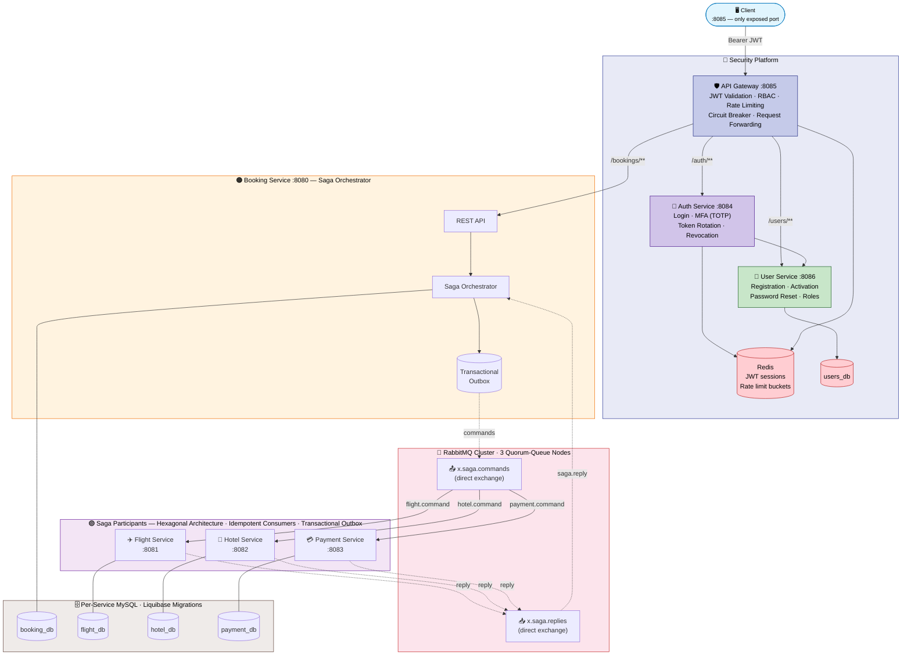
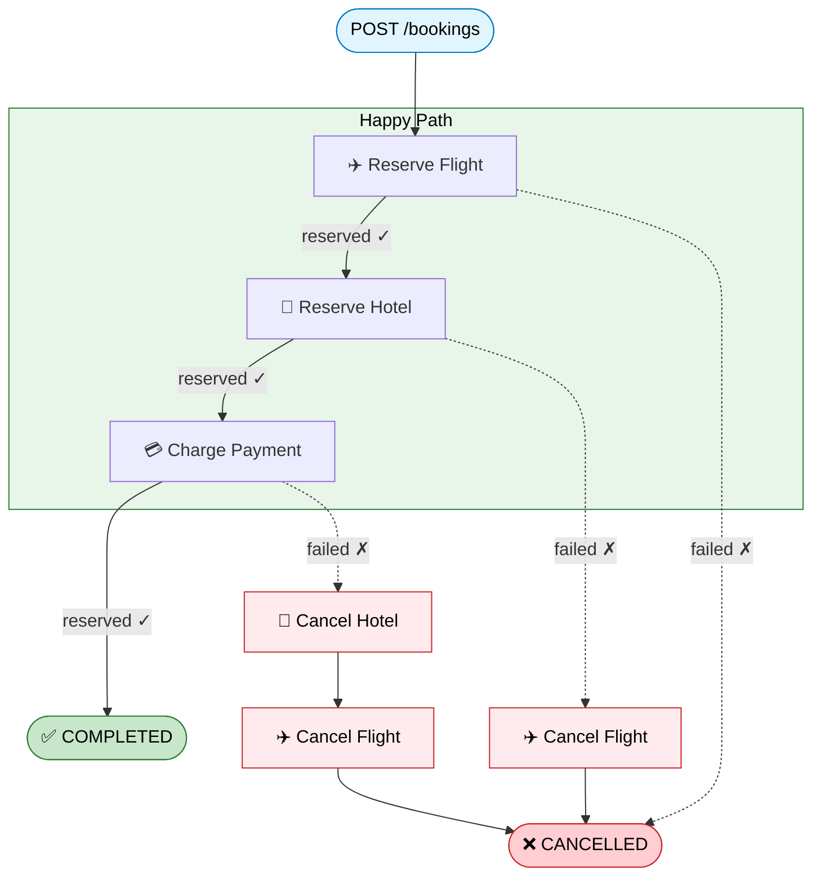

# Distributed Trip Booking System - Saga Orchestration

[](https://spring.io/projects/spring-boot) [![Java](https://img.shields.io/badge/Java-25-ED8B00.svg?logo=data:image/svg+xml;base64,PHN2ZyB4bWxucz0iaHR0cDovL3d3dy53My5vcmcvMjAwMC9zdmciIHZpZXdCb3g9IjAgMCAyNCAyNCIgZmlsbD0id2hpdGUiPjxwYXRoIGQ9Ik04Ljg1MSAxOC41NnMtLjkxNy41MzQuNjUzLjcxNGMxLjkwMi4yMTggMi44NzQuMTg3IDQuOTY5LS4yMTEgMCAwIC41NTIuMzQ2IDEuMzIxLjY0Ni00LjY5OCAyLjAxMy0xMC42MzMtLjExOC02Ljk0My0xLjE0OU04LjI3NiAxNS45MzNzLTEuMDI4Ljc2Mi41NDIuOTI0YzIuMDMyLjIwOSAzLjYzNi4yMjcgNi40MTMtLjMwOCAwIDAgLjM4NC4zODkuOTg3LjYwMi01LjY3OSAxLjY2MS0xMi4wMDcuMTMtNy45NDItMS4yMThNMTMuMTE2IDExLjQ3NWMxLjE1OCAxLjMzMy0uMzA0IDIuNTMzLS4zMDQgMi41MzNzMi45MzktMS41MTggMS41ODktMy40MThjLTEuMjYxLTEuNzcyLTIuMjI4LTIuNjUyIDMuMDA3LTUuNjg4IDAgMC04LjIxNiAyLjA1MS00LjI5MiA2LjU3M00xOS4zMyAyMC41MDRzLjY3OS41NTktLjc0Ny45OTFjLTIuNzEyLjgyMi0xMS4yODggMS4wNjktMTMuNjY5LjAzMy0uODU2LS4zNzMuNzUtLjg5IDEuMjU0LS45OTguNTI3LS4xMTQuODI4LS4wOTMuODI4LS4wOTMtLjk1My0uNjcxLTYuMTU2IDEuMzE3LTIuNjQzIDEuODg3IDkuNTggMS41NTMgMTcuNDYyLS43IDE0Ljk3NS0xLjgyTTkuMjkyIDEzLjIxcy00LjM2MiAxLjAzNi0xLjU0NCAxLjQxMmMxLjE4OS4xNTkgMy41NjEuMTIzIDUuNzctLjA2MiAxLjgwNi0uMTUyIDMuNjE4LS40NzcgMy42MTgtLjQ3N3MtLjYzNy4yNzItMS4wOTguNTg3Yy00LjQyOSAxLjE2NS0xMi45ODYuNjIzLTEwLjUyMi0uNTY5IDIuMDgyLTEuMDA2IDMuNzc2LS44OTEgMy43NzYtLjg5MU0xNy4xMTYgMTcuNTg0YzQuNTAzLTIuMzQgMi40MjEtNC41ODkuOTY4LTQuMjg1LS4zNTUuMDc0LS41MTUuMTM4LS41MTUuMTM4cy4xMzItLjIwNy4zODUtLjI5N2MyLjg3NS0xLjAxMSA1LjA4NiAyLjk4MS0uOTI5IDQuNTYyIDAgMCAuMDctLjA2Mi4wOTEtLjExOE0xNC40MDEgMHMyLjQ5NCAyLjQ5NC0yLjM2NSA2LjMzYy0zLjg5NiAzLjA3Ny0uODg5IDQuODMyIDAgNi44MzYtMi4yNzQtMi4wNTMtMy45NDMtMy44NTgtMi44MjQtNS41NCAxLjY0NC0yLjQ2OSA2LjE5Ny0zLjY2NSA1LjE4OS03LjYyNk05LjczNCAyMy45MjRjNC4zMjIuMjc3IDEwLjk1OS0uMTU0IDExLjExNi0yLjE5OCAwIDAtLjMwMi43NzUtMy41NzIgMS4zOTEtMy42ODguNjk0LTguMjM5LjYxMy0xMC45MzcuMTY4IDAgMCAuNTUzLjQ1NyAzLjM5My42MzkiLz48L3N2Zz4K)](https://openjdk.org/) [](https://www.rabbitmq.com/) [](https://www.liquibase.org/) [](https://www.docker.com/) [](https://opensource.org/licenses/MIT)

[](https://github.com/mrzodeczko-dev/saga-orchestration/actions/workflows/ci.yml) [](https://github.com/mrzodeczko-dev/saga-orchestration/actions/workflows/ci.yml) [](https://github.com/mrzodeczko-dev/saga-orchestration/actions/workflows/ci.yml) [](https://github.com/mrzodeczko-dev/saga-orchestration/actions/workflows/ci.yml) [](https://github.com/mrzodeczko-dev/saga-orchestration/actions/workflows/e2e.yml)

Monorepo for a distributed trip booking system implementing the **Saga Orchestration** pattern with **Spring Boot 4.1.0**, **Java 25**, and **Hexagonal Architecture**. The orchestrator coordinates a multi-step booking (flight, hotel, payment) across independent microservices via a 3-node **RabbitMQ quorum queue** cluster, with **Transactional Outbox**, **idempotent consumers**, and **automatic compensating transactions** on failure.

## Services

| Service | Port | Role | Description |
|---------|------|------|-------------|
| **API Gateway** | 8085 | Security | JWT validation, RBAC, rate limiting (Bucket4j + Redis), circuit breaker (Resilience4j), request forwarding |
| **Auth Service** | 8084 | Security | Login, MFA (TOTP), JWT token pair with rotation and reuse detection, server-side revocation via Redis |
| **User Service** | 8086 | Security | Registration, email activation, password reset, MFA setup, role management |
| **Booking Service** | 8080 | Orchestrator | Starts sagas, tracks step state, dispatches commands, handles replies, triggers compensation |
| **Flight Service** | 8081 | Participant | Reserves / cancels seat reservations per saga |
| **Hotel Service** | 8082 | Participant | Reserves / cancels cabin reservations per saga |
| **Payment Service** | 8083 | Participant | Charges / refunds payments per saga |

> **Note:** Only the API Gateway (port 8085) is exposed externally. All other services communicate internally via the Docker network. Booking endpoints require a valid JWT token.

## Architecture



### Saga Flow

A trip booking saga executes three steps sequentially: **FLIGHT** → **HOTEL** → **PAYMENT**. Each step follows a reserve/cancel contract. If any step fails, the orchestrator automatically compensates all previously reserved steps in reverse order.



### Messaging Topology

The system uses three RabbitMQ exchanges: `x.saga.commands` (direct) routes commands by service-specific routing keys (`flight.command`, `hotel.command`, `payment.command`), `x.saga.replies` (direct) routes all participant replies back to the orchestrator via `saga.reply`, and `x.saga.dlx` (direct) handles dead-lettered messages. Each participant has its own command queue and DLQ. All queues are quorum queues by default (replicated across the 3-node cluster).

### Reliability Guarantees

All services use the **Transactional Outbox** pattern — messages are persisted to a local outbox table within the same database transaction as the business operation, then published asynchronously by a ShedLock-coordinated poller. This ensures exactly-once semantics between the database write and the message publish. Participant services additionally implement **idempotent consumers** via a `processed_messages` table — duplicate commands (same `sagaId:action` key) are silently skipped.

## Quick Start (Docker Compose)

```bash
cp .env.example .env
# Fill in secrets (RabbitMQ passwords, DB passwords, JWT_SECRET, INTERNAL_SECRET, Redis, SMTP)
docker compose up -d --build
curl http://localhost:8085/actuator/health
```

### Register & Authenticate

```bash
# Register a new user
curl -X POST http://localhost:8085/users \
  -H "Content-Type: application/json" \
  -d '{"email":"john@example.com","password":"Secret123!","firstName":"John","lastName":"Doe"}'

# Activate account (use code from email)
curl -X POST http://localhost:8085/users/activation \
  -H "Content-Type: application/json" \
  -d '{"email":"john@example.com","code":"123456"}'

# Login (returns access + refresh token)
curl -X POST http://localhost:8085/auth/login \
  -H "Content-Type: application/json" \
  -d '{"email":"john@example.com","password":"Secret123!"}'
```

### Start a Booking (requires JWT)

```bash
curl -X POST http://localhost:8085/bookings \
  -H "Content-Type: application/json" \
  -H "Authorization: Bearer <access_token>" \
  -d '{"customerName":"John","destination":"Mars","amount":9999.99}'
```

### Check Saga Status

```bash
curl http://localhost:8085/bookings/{sagaId} \
  -H "Authorization: Bearer <access_token>"
```

## Repository Structure

```
saga-orchestration/
├── booking-service/                   # Saga orchestrator
│   ├── src/main/java/com/rzodeczko/
│   │   ├── application/
│   │   │   ├── command/               # StartTripBookingCommand
│   │   │   ├── dto/                   # SagaInstanceDto, SagaStepDto
│   │   │   ├── event/                 # SagaReply, SagaAction, ReplyStatus
│   │   │   ├── port/in/              # StartTripBookingUseCase, HandleSagaReplyUseCase, GetSagaUseCase
│   │   │   ├── port/out/             # SagaCommandPort, SagaInstanceRepository
│   │   │   └── service/              # SagaOrchestratorImpl, SagaQueryServiceImpl
│   │   ├── domain/
│   │   │   ├── exception/            # InvalidSagaStateException, SagaNotFoundException
│   │   │   └── model/saga/           # SagaInstance, SagaStep, SagaStepName, SagaStatus, SagaStepStatus
│   │   ├── infrastructure/
│   │   │   ├── configuration/        # BeanConfiguration
│   │   │   ├── messaging/            # OutboxSagaCommandPublisher, SagaReplyListener, SagaTopologyConfig
│   │   │   ├── outbox/               # OutboxEvent, OutboxEventService, OutboxEventPublisher
│   │   │   ├── persistence/          # SagaInstanceEntity, SagaStepEntity, JPA adapter, mapper
│   │   │   └── tx/                   # TransactionalSagaOrchestrator, TransactionalSagaQueryService
│   │   └── presentation/
│   │       ├── controller/           # BookingController
│   │       ├── dto/                  # StartTripBookingRequestDto, BookingResponseDto
│   │       └── exception/            # GlobalExceptionHandler
│   ├── src/main/resources/
│   │   ├── application.yaml
│   │   └── db/changelog/             # Liquibase migrations (per-service)
│   ├── Dockerfile
│   └── pom.xml
├── flight-service/                    # Saga participant (seat reservations)
│   ├── src/main/java/com/rzodeczko/
│   │   ├── application/              # FlightCommandService, ports, events
│   │   ├── domain/model/             # SeatReservation, ReservationOutcome, ReservationStatus
│   │   ├── infrastructure/
│   │   │   ├── idempotency/          # ProcessedMessageEntity, JpaProcessedMessageRepository
│   │   │   ├── messaging/            # FlightCommandListener, OutboxSagaReplyPublisher
│   │   │   ├── outbox/               # OutboxEventEntity, OutboxEventService, OutboxEventPublisher
│   │   │   └── persistence/          # SeatReservationEntity, JPA adapter, mapper
│   │   └── presentation/
│   │       └── controller/           # ReservationController
│   ├── Dockerfile
│   └── pom.xml
├── hotel-service/                     # Saga participant (cabin reservations)
│   ├── src/main/java/com/rzodeczko/  # Same structure as flight-service
│   ├── Dockerfile
│   └── pom.xml
├── payment-service/                   # Saga participant (charges & refunds)
│   ├── src/main/java/com/rzodeczko/  # Same structure as flight-service
│   ├── Dockerfile
│   └── pom.xml
├── rabbitmq/                          # Custom RabbitMQ cluster image
│   ├── Dockerfile                     # Parameterized RABBITMQ_VERSION
│   ├── rabbitmq.conf                  # Quorum queues, cluster formation, Prometheus
│   ├── rabbitmq-definitions.json      # Users, vhosts, permissions
│   └── enabled_plugins
├── .github/workflows/
│   ├── ci.yml                         # Unit & contract tests (4 services)
│   ├── e2e.yml                        # End-to-end tests (Docker Compose)
│   └── dockerhub-publish-images.yml   # Publish Docker images after E2E pass
├── docker-compose.yml                 # Full stack (5 MySQL + 3 RabbitMQ + Redis + 7 services)
├── .env.example                       # All environment variables (saga + security platform)
└── .gitignore
```

## CI/CD

The project uses three GitHub Actions workflows. **`ci.yml`** has two jobs: **Flight Service**, **Hotel Service**, and **Payment Service** build in parallel — each produces Spring Cloud Contract stubs and caches them. **Booking Service** then builds and runs contract tests against all three stub sets. All jobs upload JaCoCo coverage reports and Surefire test results as artifacts. **`e2e.yml`** spins up the full Docker Compose stack and runs end-to-end saga tests. **`dockerhub-publish-images.yml`** triggers after a successful E2E run on `master`/`develop` and publishes all four service images to Docker Hub.

## Tech Stack

| Layer | Technology |
|-------|------------|
| Language | Java 25 (virtual threads via Project Loom) |
| Framework | Spring Boot 4.1.0 |
| Messaging | RabbitMQ 4.1.1 (3-node quorum queue cluster) |
| Messaging client | Spring AMQP (publisher confirms, returns, retry) |
| Outbox | Transactional Outbox pattern (ShedLock 6.0.2 + JPA) |
| Contract Testing | Spring Cloud Contract 2025.1.0 |
| Database | MySQL 9.6 (per-service isolation) |
| Persistence | Spring Data JPA, HikariCP |
| Migrations | Liquibase (Spring Boot Starter) |
| Validation | Spring Boot Starter Validation (Hibernate Validator) |
| Code Coverage | JaCoCo 0.8.13 (80% line coverage gate) |
| Integration Testing | Testcontainers (MySQL, RabbitMQ), Awaitility |
| Security | JWT (access + refresh tokens), RBAC, MFA (TOTP), rate limiting (Bucket4j + Redis), circuit breaker (Resilience4j) |
| API Gateway | Custom Spring Boot gateway with JWT validation, request forwarding, internal secret header |
| Error Handling | RFC 9457 ProblemDetail (application/problem+json) |
| Observability | Spring Boot Actuator |
| Build | Maven 3.9, multi-stage Docker build with CDS extraction |
| Containerisation | Docker, Docker Compose v2+ |
| CI/CD | GitHub Actions |
| Utilities | Lombok, Jackson |

## Contact

Designed and implemented by **Michał Rzodeczko**.
GitHub: [mrzodeczko-dev](https://github.com/mrzodeczko-dev)
