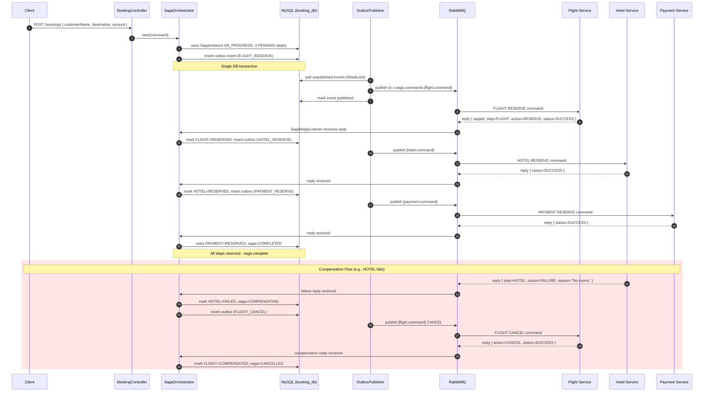
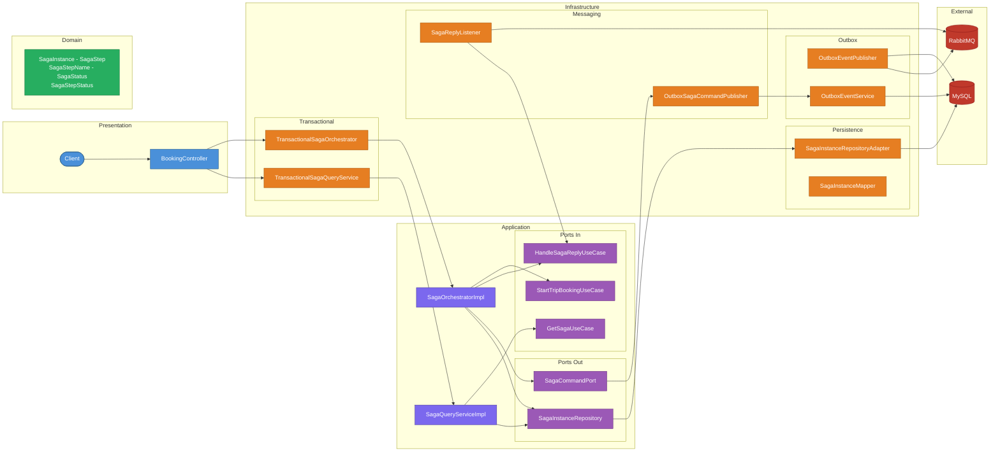

# Booking Service - Saga Orchestrator

[](https://spring.io/projects/spring-boot)
[](https://openjdk.org/)
[](https://www.docker.com/)
[](https://www.rabbitmq.com/)
[](https://opensource.org/licenses/MIT)

<a id="overview"></a>
## Overview
[Back to Table of Contents](#toc)

Booking Service is the **Saga Orchestrator** for trip bookings in the saga-orchestration platform. It coordinates a distributed transaction across three participant services — **Flight**, **Hotel**, and **Payment** — using the orchestration-based saga pattern. The orchestrator drives the forward flow (FLIGHT -> HOTEL -> PAYMENT) and, on any failure, triggers compensating actions in reverse order. Commands are published through a transactional outbox table to guarantee exactly-once delivery to RabbitMQ, and replies are consumed from a dedicated reply queue. Built with Hexagonal Architecture, the domain model is fully decoupled from messaging and persistence infrastructure.

<a id="toc"></a>
## Table of Contents
- [Overview](#overview)
- [How It Works](#how-it-works)
- [API Endpoints](#api-endpoints)
- [Getting Started](#getting-started)
- [Environment Variables](#environment-variables)
- [Common Issues](#common-issues)
- [Architecture](#architecture)
- [Tech Stack](#tech-stack)
- [Testing](#testing)
- [Repository Structure](#repository-structure)
- [Contact](#contact)

---

<a id="how-it-works"></a>
## How It Works
[Back to Table of Contents](#toc)

### Forward Flow (Happy Path)

1. Client calls `POST /bookings` with `customerName`, `destination`, and `amount`
2. `BookingController` delegates to `StartTripBookingUseCase` (via the `TransactionalSagaOrchestrator` decorator)
3. `SagaInstance.start()` creates a new saga with three steps in PENDING status: **FLIGHT**, **HOTEL**, **PAYMENT**
4. The saga is persisted to MySQL and the first command (`FLIGHT RESERVE`) is written to the **outbox table** within the same database transaction — guaranteeing atomicity between state change and command publication
5. `OutboxEventPublisher` (ShedLock-coordinated poller, 1 s interval) picks up unpublished outbox events and sends them to RabbitMQ via `x.saga.commands` exchange with routing key `flight.command`
6. When the Flight Service replies with `SUCCESS` on `q.booking-service.replies`, `SagaReplyListener` delegates to `HandleSagaReplyUseCase`
7. The orchestrator marks the FLIGHT step as RESERVED and enqueues the next command (`HOTEL RESERVE`) via the outbox
8. Steps 6-7 repeat for HOTEL and PAYMENT
9. After the last step (PAYMENT) is RESERVED, the saga is marked **COMPLETED**

### Compensation Flow (Failure)

10. If any participant replies with `FAILURE` (e.g., HOTEL fails), the orchestrator marks that step as FAILED with the failure reason and transitions the saga to **COMPENSATING**
11. The orchestrator finds the last RESERVED step (in reverse order) and sends a `CANCEL` command
12. On `SUCCESS` reply to a CANCEL, the step is marked COMPENSATED, and the next step to compensate (going backwards) receives a CANCEL command
13. When all reserved steps are compensated, the saga is marked **CANCELLED**
14. If a compensation step itself fails, the saga transitions to **COMPENSATION_FAILED** — manual intervention required

### Idempotency & Late Replies

- If a `RESERVE SUCCESS` reply arrives for a step that is already RESERVED, the duplicate is silently ignored
- If a `CANCEL SUCCESS` reply arrives for a step that is already COMPENSATED, the duplicate is silently ignored
- Replies arriving for sagas in a terminal state (COMPLETED, CANCELLED, COMPENSATION_FAILED) are logged and discarded

### Transactional Outbox Pattern

Commands are never published directly to RabbitMQ from the saga orchestrator. Instead, `OutboxSagaCommandPublisher` calls `OutboxEventService` (which uses `Propagation.MANDATORY` — it must run within an existing transaction) to insert a row into the `outbox_events` table. The `OutboxEventPublisher` poller, protected by ShedLock to prevent duplicate processing in clustered deployments, reads unpublished events, sends them to RabbitMQ (with publisher confirms), and marks them as published. This guarantees that a saga state change and its corresponding command are committed atomically.



---

<a id="api-endpoints"></a>
## API Endpoints
[Back to Table of Contents](#toc)

**Base URL:** `http://localhost:${SERVER_PORT}`

### Booking Endpoints

| Method | Path | Purpose | Request Body | Success | Common Errors |
|--------|------|---------|--------------|---------|---------------|
| `POST` | `/bookings` | Start a new trip booking saga | `StartTripBookingRequestDto` | `201 Created` | `400` |
| `GET` | `/bookings/{sagaId}` | Get saga instance by ID | -- | `200 OK` | `404` |
| `GET` | `/bookings` | List all saga instances | -- | `200 OK` | -- |

### Health Endpoints

| Method | Path | Purpose | Success |
|--------|------|---------|---------|
| `GET` | `/actuator/health` | Actuator health check (details: always) | `200 OK` |

### Request / Response DTOs

**`StartTripBookingRequestDto`** (request body for `POST /bookings`):

| Field | Type | Validation |
|-------|------|------------|
| `customerName` | `String` | `@NotBlank` |
| `destination` | `String` | `@NotBlank` |
| `amount` | `BigDecimal` | `@NotNull`, `@Positive` |

**`BookingResponseDto`** (response for all endpoints):

| Field | Type | Description |
|-------|------|-------------|
| `sagaId` | `UUID` | Unique saga identifier |
| `customerName` | `String` | Customer name |
| `destination` | `String` | Travel destination |
| `amount` | `BigDecimal` | Booking amount |
| `status` | `String` | `IN_PROGRESS`, `COMPLETED`, `COMPENSATING`, `CANCELLED`, `COMPENSATION_FAILED` |
| `steps` | `List<SagaStepResponseDto>` | Step name, status, and failure reason |

### cURL Examples

```bash
# Start a trip booking saga (requires JWT via API Gateway)
curl -X POST http://localhost:8085/bookings \
  -H "Content-Type: application/json" \
  -H "Authorization: Bearer <access_token>" \
  -d '{"customerName": "John Doe", "destination": "Paris", "amount": 1500.00}'

# Get saga by ID
curl http://localhost:8085/bookings/550e8400-e29b-41d4-a716-446655440000 \
  -H "Authorization: Bearer <access_token>"

# List all sagas
curl http://localhost:8085/bookings \
  -H "Authorization: Bearer <access_token>"

# Health check
curl http://localhost:8085/actuator/health
```

---

<a id="getting-started"></a>
## Getting Started
[Back to Table of Contents](#toc)

### Prerequisites

- Docker and Docker Compose v2+
- Java 25+ and Maven 3.9+ (for local builds only)
- Running instances of `flight-service`, `hotel-service`, and `payment-service` (or start all via the root `docker-compose.yml`)

### Environment Configuration

From the repository root, copy the example and fill in secrets:

```bash
cp .env.example .env
```

See `.env.example` for all required variables with descriptions.

### Start the Service

```bash
docker compose up -d --build
```

Verify: `curl http://localhost:8085/actuator/health` -> `{"status":"UP"}`

---

<a id="environment-variables"></a>
## Environment Variables
[Back to Table of Contents](#toc)

| Variable | Required | Description | Default |
|----------|----------|-------------|---------|
| `SERVER_PORT` | yes | HTTP port the service listens on | `8080` |
| `SPRING_APPLICATION_NAME` | yes | Application name for discovery/logging | `booking-service` |
| `SPRING_DATASOURCE_URL` | yes | JDBC URL for MySQL (e.g., `jdbc:mysql://booking-mysql:3306/booking_db`) | -- |
| `SPRING_DATASOURCE_USERNAME` | yes | MySQL username | -- |
| `SPRING_DATASOURCE_PASSWORD` | yes | MySQL password | -- |
| `SPRING_RABBITMQ_ADDRESSES` | yes | RabbitMQ broker address(es) | -- |
| `SPRING_RABBITMQ_USERNAME` | yes | RabbitMQ username | -- |
| `SPRING_RABBITMQ_PASSWORD` | yes | RabbitMQ password | -- |
| `SPRING_RABBITMQ_VIRTUAL_HOST` | yes | RabbitMQ virtual host | -- |
| `BOOKING_SERVICE_MYSQL_DB_HOST` | yes | MySQL host (docker-compose) | -- |
| `BOOKING_SERVICE_MYSQL_DB_PORT` | yes | MySQL port | `3306` |
| `BOOKING_SERVICE_MYSQL_DB_NAME` | yes | Database name | `booking_db` |
| `BOOKING_SERVICE_MYSQL_DB_USER` | yes | Database user | -- |
| `BOOKING_SERVICE_MYSQL_DB_PASSWORD` | yes | Database password | -- |
| `BOOKING_SERVICE_MYSQL_DB_ROOT_PASSWORD` | yes | MySQL root password (container init) | -- |

---

<a id="common-issues"></a>
## Common Issues
[Back to Table of Contents](#toc)

1. **MySQL connection refused** -- verify `SPRING_DATASOURCE_URL` matches the MySQL container host and port on the Docker network. HikariCP connection timeout is 2 000 ms. Check with `docker compose logs booking-mysql`.

2. **RabbitMQ not reachable** -- the service requires RabbitMQ to be running and accessible at `SPRING_RABBITMQ_ADDRESSES`. Verify the virtual host exists and the credentials have permissions. Inspect with `docker compose logs rabbitmq`.

3. **Outbox events not being published** -- `OutboxEventPublisher` polls every 1 000 ms and is guarded by ShedLock (`booking_outbox_publisher`, lock at most 30 s). Ensure ShedLock's database table (`shedlock`) was created by Liquibase migrations (`db/changelog/changes/004-create-shedlock-table.yaml`). If running multiple instances, verify that only one holds the lock at a time.

4. **Saga stuck in IN_PROGRESS** -- a participant service may not have sent a reply. Check the participant service logs, verify RabbitMQ queues (`q.booking-service.replies` should have no stuck messages), and inspect the DLQ (`q.booking-service.replies.dlq`) for rejected messages.

5. **Duplicate saga commands** -- the outbox pattern guarantees at-least-once delivery. Participant services must be idempotent. If the poller crashes after publishing but before marking the event as published, the same command will be resent on the next poll cycle.

6. **Reply listener errors / messages in DLQ** -- the consumer retries up to 5 times with 2 s initial interval (x2 multiplier). After exhausting retries, messages are dead-lettered to `q.booking-service.replies.dlq` via `x.saga.dlx`. Rejected messages are not requeued (`default-requeue-rejected: false`).

---

<a id="architecture"></a>
## Architecture
[Back to Table of Contents](#toc)



**Technical Highlights:**

- **Hexagonal Architecture:** Domain and application layers are fully decoupled from infrastructure. `SagaCommandPort` and `SagaInstanceRepository` define output contracts; `StartTripBookingUseCase`, `HandleSagaReplyUseCase`, and `GetSagaUseCase` define input contracts. Adapters implement them without leaking infrastructure details into business logic.
- **Transactional Outbox Pattern:** `OutboxSagaCommandPublisher` writes commands to an outbox table within the same database transaction as the saga state change (via `OutboxEventService` with `Propagation.MANDATORY`). `OutboxEventPublisher` polls the outbox and publishes to RabbitMQ with publisher confirms. This eliminates dual-write problems and guarantees at-least-once delivery.
- **ShedLock Coordination:** The outbox poller uses ShedLock 6.0.2 to ensure only one instance publishes events in a clustered deployment (`lockAtMostFor: 30s`, `lockAtLeastFor: 500ms`).
- **Rich Domain Model:** `SagaInstance` encapsulates all saga state transitions (`start`, `markReserved`, `complete`, `failAndStartCompensation`, `markCompensated`, `markCompensationFailed`, `cancel`) with validation. `SagaStep` enforces valid status transitions. `SagaStepName` defines the execution order via `next()`.
- **Transactional Decorators:** `TransactionalSagaOrchestrator` and `TransactionalSagaQueryService` wrap application services with `@Transactional` boundaries, keeping transaction management in the infrastructure layer and the application layer annotation-free.
- **RabbitMQ Reliability:** Publisher confirms (correlated mode), publisher returns with mandatory flag, consumer retry (5 retries, 2 s initial, x2 multiplier), prefetch of 10, dead-letter exchange for poison messages, and no requeue on reject.
- **Virtual Threads + container-aware JVM:** `spring.threads.virtual.enabled=true` with `-XX:+UseContainerSupport -XX:MaxRAMPercentage=75.0 -XX:+UseG1GC -XX:+ExitOnOutOfMemoryError`.

---

<a id="tech-stack"></a>
## Tech Stack
[Back to Table of Contents](#toc)

| Layer | Technology |
|-------|------------|
| Language | Java 25 (virtual threads via Project Loom) |
| Framework | Spring Boot 4.1.0 |
| Messaging | Spring AMQP, RabbitMQ |
| Persistence | Spring Data JPA, Hibernate (MySQLDialect), HikariCP (pool: 20) |
| Migrations | Liquibase (Spring Boot Starter) |
| Database | MySQL |
| Scheduling | Spring Scheduling, ShedLock 6.0.2 |
| Contract Testing | Spring Cloud Contract 2025.1.0 |
| Serialization | Jackson |
| Build | Maven 3.9, JaCoCo 0.8.13 (80% line coverage gate) |
| Testing | JUnit 5, Mockito |
| Integration Testing | Testcontainers (MySQL, RabbitMQ), Awaitility |
| Containerisation | Docker, multi-stage build with CDS extraction (maven:3.9.11-eclipse-temurin-25-alpine -> eclipse-temurin:25-jre-alpine) |
| Observability | Spring Boot Actuator |
| Utilities | Lombok |

---

<a id="testing"></a>
## Testing
[Back to Table of Contents](#toc)

The service has a comprehensive test suite covering the domain model, application services, infrastructure adapters, presentation layer, and consumer/producer contract verification. Unit tests use Mockito for isolation; integration tests use Testcontainers (MySQL, RabbitMQ) and Awaitility; contract tests use Spring Cloud Contract to verify message formats and consumer compatibility.

### Running Tests

```bash
mvn test
```

### Test Classes

#### Unit Tests

##### `SagaOrchestratorImplTest`

| Test | Scenario |
|------|----------|
| saga start | creates SagaInstance, persists it, sends RESERVE command for the first step (FLIGHT) |
| forward reply - success | marks step RESERVED, sends next step command |
| forward reply - success (last step) | marks last step RESERVED, completes the saga |
| forward reply - failure | marks step FAILED, transitions to COMPENSATING, sends CANCEL for last reserved step |
| forward reply - failure (no reserved steps) | marks step FAILED, transitions directly to CANCELLED |
| compensation reply - success | marks step COMPENSATED, sends CANCEL for next step to compensate |
| compensation reply - success (last compensation) | marks step COMPENSATED, cancels the saga |
| compensation reply - failure | marks step COMPENSATION_FAILED, transitions saga to COMPENSATION_FAILED |
| idempotent reserved check | duplicate RESERVE SUCCESS for already-reserved step is silently ignored |
| late reply ignore | replies for sagas in terminal states (COMPLETED, CANCELLED) are logged and discarded |

##### `SagaQueryServiceImplTest`

| Test | Scenario |
|------|----------|
| getById | returns saga DTO for existing saga |
| listAll | returns all sagas as DTOs |
| not found | throws `SagaNotFoundException` for unknown ID |

##### `SagaInstanceTest`

| Test | Scenario |
|------|----------|
| start validation | rejects null/blank customerName, null/blank destination, null/non-positive amount |
| start | creates saga with 3 PENDING steps in FLIGHT-HOTEL-PAYMENT order, status IN_PROGRESS |
| nextStepToReserve | returns first PENDING step |
| nextStepToCompensate | returns last RESERVED step (reverse order) |
| markReserved | transitions step to RESERVED |
| complete | transitions saga to COMPLETED |
| failAndStartCompensation | marks step FAILED with reason, transitions saga to COMPENSATING |
| markCompensated | transitions step to COMPENSATED |
| markCompensationFailed | marks step COMPENSATION_FAILED with reason, transitions saga to COMPENSATION_FAILED |
| cancel | transitions saga to CANCELLED |

##### `SagaStepTest`

| Test | Scenario |
|------|----------|
| status transitions | validates allowed transitions between PENDING, RESERVED, FAILED, COMPENSATED, COMPENSATION_FAILED |

##### `SagaStepNameTest`

| Test | Scenario |
|------|----------|
| next() logic | FLIGHT -> HOTEL -> PAYMENT -> empty (no next after PAYMENT) |

##### `OutboxSagaCommandPublisherTest`

| Test | Scenario |
|------|----------|
| sendReserve routing | RESERVE commands routed to correct exchange/routing key per step |
| sendCancel routing | CANCEL commands routed to correct exchange/routing key per step |

##### `SagaReplyListenerTest`

| Test | Scenario |
|------|----------|
| message mapping | `SagaReplyMessage` correctly mapped to `SagaReply` domain event and delegated to use case |

##### `OutboxEventServiceTest`

| Test | Scenario |
|------|----------|
| save with serialization | event payload serialized to JSON, persisted with correct exchange and routing key |

##### `SagaInstanceRepositoryAdapterTest`

| Test | Scenario |
|------|----------|
| persistence adapter | save and findById delegate correctly to JPA repository via mapper |

##### `SagaInstanceMapperTest`

| Test | Scenario |
|------|----------|
| entity/domain mapping | bidirectional mapping between `SagaInstanceEntity`/`SagaStepEntity` and `SagaInstance`/`SagaStep` |

##### `BookingControllerTest`

| Test | Scenario |
|------|----------|
| POST /bookings | valid request returns 201 with Location header and saga response |
| POST /bookings (validation) | invalid request (blank fields, non-positive amount) returns 400 |
| GET /bookings/{sagaId} | existing saga returns 200 with full response |
| GET /bookings/{sagaId} (not found) | unknown ID returns 404 |
| GET /bookings | returns 200 with list of all sagas |

##### `GlobalExceptionHandlerTest`

| Test | Scenario |
|------|----------|
| exception handling | All handlers return `ProblemDetail` (RFC 9457): `SagaNotFoundException` -> 404, `InvalidSagaStateException` -> 400, validation errors -> 400, generic -> 500 |

#### Contract Tests

##### `CommandMessageContractTest`

| Test | Scenario |
|------|----------|
| command message format | verifies that `ParticipantCommandMessage` produced by the orchestrator matches the contract schema expected by participant services |

##### `FlightReplyConsumerContractTest`

| Test | Scenario |
|------|----------|
| reply consumption | verifies that the orchestrator correctly consumes reply messages against flight-service contract stubs |

##### `HotelReplyConsumerContractTest`

| Test | Scenario |
|------|----------|
| reply consumption | verifies that the orchestrator correctly consumes reply messages against hotel-service contract stubs |

##### `PaymentReplyConsumerContractTest`

| Test | Scenario |
|------|----------|
| reply consumption | verifies that the orchestrator correctly consumes reply messages against payment-service contract stubs |

#### Integration Tests

##### `SagaFlowIntegrationTest`

| Test | Scenario |
|------|----------|
| end-to-end saga flow | Full saga lifecycle with Testcontainers (MySQL + RabbitMQ) |

##### `OutboxEventServiceIntegrationTest`

| Test | Scenario |
|------|----------|
| outbox persistence | Outbox event serialization and persistence with real database |

##### `OutboxEventPublisherIntegrationTest`

| Test | Scenario |
|------|----------|
| outbox publishing | Outbox polling and RabbitMQ publishing with real broker |

##### `SagaTopologyIntegrationTest`

| Test | Scenario |
|------|----------|
| topology declaration | RabbitMQ exchange/queue topology verification |

##### `SagaReplyListenerIntegrationTest`

| Test | Scenario |
|------|----------|
| reply processing | End-to-end reply consumption from RabbitMQ |

##### `SagaInstanceRepositoryAdapterIntegrationTest`

| Test | Scenario |
|------|----------|
| persistence adapter | JPA persistence with real MySQL via Testcontainers |

---

<a id="repository-structure"></a>
## Repository Structure
[Back to Table of Contents](#toc)

```text
.
├── booking-service/
│   ├── src/
│   │   ├── main/
│   │   │   ├── java/com/rzodeczko/
│   │   │   │   ├── application/
│   │   │   │   │   ├── command/              # StartTripBookingCommand
│   │   │   │   │   ├── dto/                  # SagaInstanceDto, SagaStepDto
│   │   │   │   │   ├── event/                # SagaReply, SagaAction, ReplyStatus
│   │   │   │   │   ├── port/
│   │   │   │   │   │   ├── in/               # StartTripBookingUseCase,
│   │   │   │   │   │   │                     #   HandleSagaReplyUseCase,
│   │   │   │   │   │   │                     #   GetSagaUseCase
│   │   │   │   │   │   └── out/              # SagaCommandPort,
│   │   │   │   │   │                         #   SagaInstanceRepository
│   │   │   │   │   └── service/              # SagaOrchestratorImpl,
│   │   │   │   │                             #   SagaQueryServiceImpl
│   │   │   │   ├── domain/
│   │   │   │   │   ├── exception/            # InvalidSagaStateException,
│   │   │   │   │   │                         #   SagaNotFoundException
│   │   │   │   │   └── model/saga/           # SagaInstance, SagaStep,
│   │   │   │   │                             #   SagaStepName, SagaStatus,
│   │   │   │   │                             #   SagaStepStatus
│   │   │   │   ├── infrastructure/
│   │   │   │   │   ├── configuration/        # BeanConfiguration
│   │   │   │   │   ├── messaging/            # SagaTopologyConfig,
│   │   │   │   │   │                         #   SagaTopologyProperties,
│   │   │   │   │   │                         #   SagaReplyListener,
│   │   │   │   │   │                         #   OutboxSagaCommandPublisher,
│   │   │   │   │   │                         #   RabbitMqConfig
│   │   │   │   │   │   └── dto/              # ParticipantCommandMessage,
│   │   │   │   │   │                         #   SagaReplyMessage
│   │   │   │   │   ├── outbox/               # OutboxEvent, OutboxEventPublisher,
│   │   │   │   │   │                         #   OutboxEventService,
│   │   │   │   │   │                         #   OutboxEventRepository,
│   │   │   │   │   │                         #   OutboxSerializationException
│   │   │   │   │   ├── persistence/
│   │   │   │   │   │   ├── adapter/          # SagaInstanceRepositoryAdapter
│   │   │   │   │   │   ├── entity/           # SagaInstanceEntity, SagaStepEntity
│   │   │   │   │   │   ├── mapper/           # SagaInstanceMapper
│   │   │   │   │   │   └── repository/       # JpaSagaInstanceRepository
│   │   │   │   │   └── tx/                   # TransactionalSagaOrchestrator,
│   │   │   │   │                             #   TransactionalSagaQueryService
│   │   │   │   └── presentation/
│   │   │   │       ├── controller/           # BookingController
│   │   │   │       ├── dto/
│   │   │   │       │   ├── request/          # StartTripBookingRequestDto
│   │   │   │       │   └── response/         # BookingResponseDto,
│   │   │   │       │                         #   SagaStepResponseDto
│   │   │   │       └── exception/            # GlobalExceptionHandler
│   │   │   └── resources/
│   │   │       ├── application.yaml
│   │   │       └── db/changelog/
│   │   │           ├── db.changelog-master.yaml
│   │   │           └── changes/
│   │   │               ├── 001-create-saga-instances-table.yaml
│   │   │               ├── 002-create-saga-steps-table.yaml
│   │   │               ├── 003-create-outbox-events-table.yaml
│   │   │               └── 004-create-shedlock-table.yaml
│   │   └── test/
│   │       ├── java/com/rzodeczko/
│   │       │   ├── application/service/      # SagaOrchestratorImplTest,
│   │       │   │                             #   SagaQueryServiceImplTest
│   │       │   ├── contracts/                # CommandMessageContractTest,
│   │       │   │                             #   FlightReplyConsumerContractTest
│   │       │   ├── domain/model/saga/        # SagaInstanceTest, SagaStepTest,
│   │       │   │                             #   SagaStepNameTest
│   │       │   ├── infrastructure/
│   │       │   │   ├── messaging/            # OutboxSagaCommandPublisherTest,
│   │       │   │   │                         #   SagaReplyListenerTest
│   │       │   │   ├── outbox/               # OutboxEventServiceTest
│   │       │   │   └── persistence/
│   │       │   │       ├── adapter/          # SagaInstanceRepositoryAdapterTest
│   │       │   │       └── mapper/           # SagaInstanceMapperTest
│   │       │   ├── presentation/
│   │       │   │   ├── controller/           # BookingControllerTest
│   │       │   │   └── exception/            # GlobalExceptionHandlerTest
│   │       │   └── IntegrationTestBase.java
│   │       └── resources/
│   │           └── application.yml
│   ├── Dockerfile
│   └── pom.xml
```

---

<a id="contact"></a>
## Contact
[Back to Table of Contents](#toc)

Designed and implemented by **Michal Rzodeczko**.
GitHub: [mrzodeczko-dev](https://github.com/mrzodeczko-dev)
