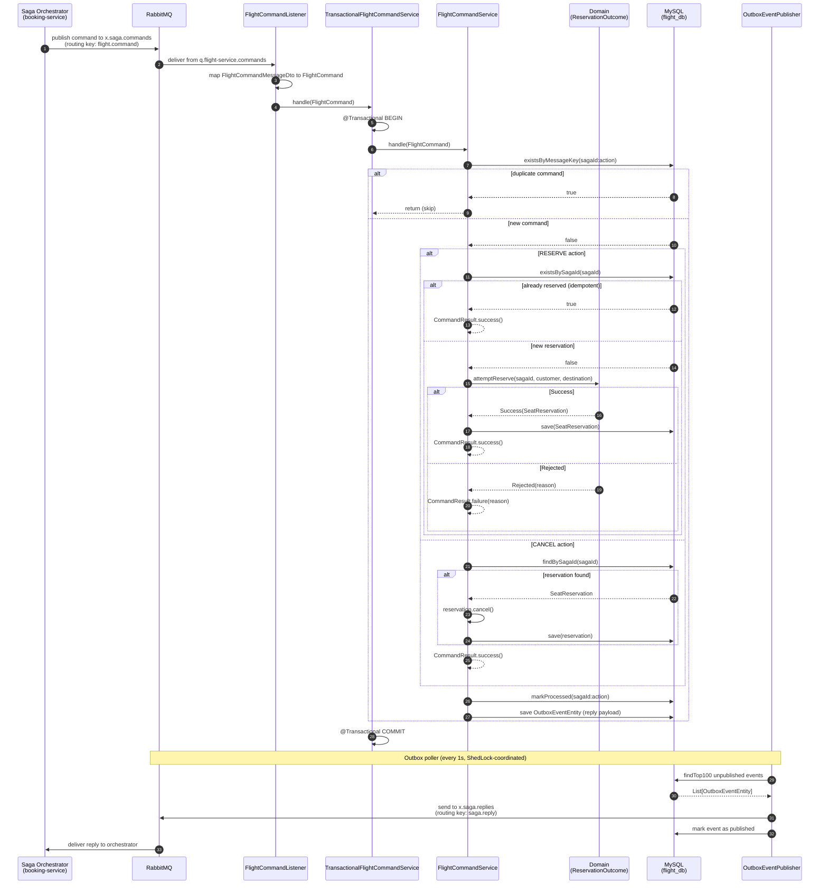
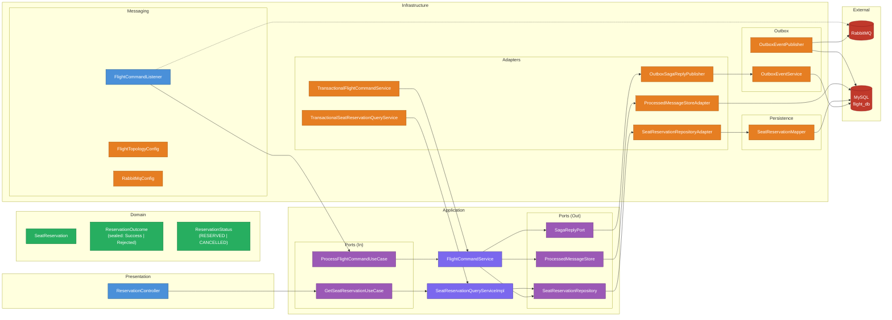

# Flight Service - Saga Participant (Seat Reservations)

[](https://spring.io/projects/spring-boot)
[](https://openjdk.org/)
[](https://www.docker.com/)
[](https://www.rabbitmq.com/)
[](https://opensource.org/licenses/MIT)

<a id="overview"></a>
## Overview
[Back to Table of Contents](#toc)

Flight Service is a **saga participant** in the saga-orchestration platform, responsible for managing flight seat reservations as part of a distributed booking workflow. It receives RESERVE and CANCEL commands from the saga orchestrator (booking-service) via RabbitMQ, executes the corresponding domain logic within a single database transaction, and publishes a reply through the **Transactional Outbox** pattern. The service guarantees **exactly-once processing** via an idempotent consumer backed by a `processed_messages` table, and uses **Hexagonal Architecture** to keep the domain model free of infrastructure concerns.

<a id="toc"></a>
## Table of Contents
- [Overview](#overview)
- [How It Works](#how-it-works)
- [API Endpoints](#api-endpoints)
- [Getting Started](#getting-started)
- [Environment Variables](#environment-variables)
- [Common Issues](#common-issues)
- [Architecture](#architecture)
- [Tech Stack](#tech-stack)
- [Testing](#testing)
- [Repository Structure](#repository-structure)
- [Contact](#contact)

---

<a id="how-it-works"></a>
## How It Works
[Back to Table of Contents](#toc)

### Command Processing Lifecycle

1. **Message arrival** -- `FlightCommandListener` receives a JSON message from the `q.flight-service.commands` queue (bound to `x.saga.commands` exchange with routing key `flight.command`). The AMQP payload is deserialized into `FlightCommandMessageDto` and mapped to the application-layer `FlightCommand` record.

2. **Transactional delegation** -- the listener delegates to `TransactionalFlightCommandService`, an infrastructure decorator that wraps `FlightCommandService` in a `@Transactional(REQUIRED)` boundary. Everything below executes within **one database transaction**.

3. **Idempotency check** -- `FlightCommandService` builds a message key (`sagaId:action`) and queries `ProcessedMessageStore.existsByMessageKey()`. If the key already exists, the command is a duplicate and processing stops immediately (no side effects, no reply).

4. **Business logic (RESERVE)** -- if no reservation exists for the given `sagaId`, the service calls `ReservationOutcome.attemptReserve()`, a sealed-interface factory method in the domain layer. If the customer name starts with `BLOCKED` (case-insensitive), a `Rejected` outcome is returned carrying a reason string; otherwise a `Success` outcome wraps a new `SeatReservation` with status `RESERVED`. On success the reservation is persisted via `SeatReservationRepository`. If a reservation already exists for the `sagaId`, the service returns success without creating a duplicate (idempotent reserve).

5. **Business logic (CANCEL)** -- the service looks up the reservation by `sagaId`. If found, it calls `reservation.cancel()` (sets status to `CANCELLED`) and saves. If not found, it returns success (compensating a non-existent reservation is a no-op).

6. **Mark processed** -- the message key is persisted in the `processed_messages` table so future duplicates are skipped.

7. **Outbox reply** -- `SagaReplyPort.publish()` delegates to `OutboxSagaReplyPublisher`, which serializes a `SagaReplyMessageDto` and saves it as an `OutboxEventEntity` in the `outbox_events` table -- **within the same transaction** as steps 3-6.

8. **Outbox poller** -- `OutboxEventPublisher`, coordinated by ShedLock (preventing concurrent polling across instances), reads unpublished outbox events every 1 second and sends them to the `x.saga.replies` exchange with routing key `saga.reply` via `RabbitTemplate`. On success the event is marked as published; on failure the attempt count and error message are recorded for retry on the next poll cycle.

9. **Consumer receives the reply** -- the saga orchestrator (booking-service) receives the reply on `q.booking-saga.replies` and advances (or compensates) the saga state machine.

### Sequence Diagram



---

<a id="api-endpoints"></a>
## API Endpoints
[Back to Table of Contents](#toc)

**Base URL:** `http://localhost:${SERVER_PORT}` (default `8081`)

### Reservation Endpoints

| Method | Path | Purpose | Success | Error |
|--------|------|---------|---------|-------|
| `GET` | `/reservations` | List all seat reservations | `200 OK` | -- |
| `GET` | `/reservations/{sagaId}` | Get reservation by saga ID | `200 OK` | `404 Not Found` |

### Health Endpoints

| Method | Path | Purpose | Success |
|--------|------|---------|---------|
| `GET` | `/actuator/health` | Actuator health check (details always shown) | `200 OK` |

### cURL Examples

```bash
# List all reservations
curl http://localhost:8081/reservations

# Get reservation by saga ID
curl http://localhost:8081/reservations/550e8400-e29b-41d4-a716-446655440000

# Health check
curl http://localhost:8081/actuator/health
```

---

<a id="getting-started"></a>
## Getting Started
[Back to Table of Contents](#toc)

### Prerequisites

- Docker and Docker Compose v2+
- Java 25+ and Maven 3.9+ (for local builds only)
- A running RabbitMQ instance accessible from the Docker network
- A running MySQL instance (or the `flight-mysql` container from the compose file)

### Environment Configuration

From the repository root, copy the example and fill in secrets:

```bash
cp .env.example .env
```

See `.env.example` for all required variables with descriptions.

### Start the Service

```bash
docker compose up -d --build
```

Verify: `curl http://localhost:8081/actuator/health` -> `{"status":"UP"}`

---

<a id="environment-variables"></a>
## Environment Variables
[Back to Table of Contents](#toc)

| Variable | Required | Description | Default |
|----------|----------|-------------|---------|
| `SERVER_PORT` | yes | HTTP port for the service | `8081` |
| `SPRING_APPLICATION_NAME` | yes | Application name registered with Spring | `flight-service` |
| `SPRING_DATASOURCE_URL` | yes | JDBC URL for MySQL (e.g. `jdbc:mysql://flight-mysql:3308/flight_db`) | -- |
| `SPRING_DATASOURCE_USERNAME` | yes | MySQL username | -- |
| `SPRING_DATASOURCE_PASSWORD` | yes | MySQL password | -- |
| `SPRING_RABBITMQ_ADDRESSES` | yes | RabbitMQ connection address(es) | -- |
| `SPRING_RABBITMQ_USERNAME` | yes | RabbitMQ username | -- |
| `SPRING_RABBITMQ_PASSWORD` | yes | RabbitMQ password | -- |
| `SPRING_RABBITMQ_VIRTUAL_HOST` | yes | RabbitMQ virtual host | -- |
| `FLIGHT_SERVICE_MYSQL_DB_HOST` | yes | MySQL host (Docker Compose) | `flight-mysql` |
| `FLIGHT_SERVICE_MYSQL_DB_PORT` | yes | MySQL port | `3308` |
| `FLIGHT_SERVICE_MYSQL_DB_NAME` | yes | MySQL database name | `flight_db` |
| `FLIGHT_SERVICE_MYSQL_DB_USER` | yes | MySQL user | -- |
| `FLIGHT_SERVICE_MYSQL_DB_PASSWORD` | yes | MySQL password | -- |
| `FLIGHT_SERVICE_MYSQL_DB_ROOT_PASSWORD` | yes | MySQL root password (Docker init) | -- |

---

<a id="common-issues"></a>
## Common Issues
[Back to Table of Contents](#toc)

1. **RabbitMQ connection refused** -- verify `SPRING_RABBITMQ_ADDRESSES` points to a host and port reachable from inside the Docker network. The service retries publishing (5 retries, 2 s initial interval, x2 multiplier) but will not start if the broker is unreachable at boot. Check `docker compose logs flight-service | grep -i "rabbit"`.

2. **MySQL connection timeout** -- HikariCP connection timeout is 2 000 ms. If the database is not ready when the service starts, connections will fail. Ensure the MySQL container has a healthcheck and `depends_on: condition: service_healthy` in `docker-compose.yml`.

3. **Duplicate commands still processed** -- the `processed_messages` table uses a composite key of `sagaId:action`. If the table was truncated or the database was recreated, idempotency history is lost. This is expected in development but should not happen in production.

4. **Outbox events stuck as unpublished** -- if the RabbitMQ broker is down, events accumulate in `outbox_events` with `published = false`. Once the broker recovers, the ShedLock-coordinated poller will drain them automatically (up to 100 per cycle, every 1 second). Check `lastError` and `attemptCount` columns for diagnostics.

5. **Messages landing in DLQ** -- after 5 consumer retries (2 s, 4 s, 8 s, 16 s, 32 s), unprocessable messages are routed to `q.flight-service.commands.dlq` via the `x.saga.dlx` dead-letter exchange. Inspect DLQ messages with `rabbitmqadmin get queue=q.flight-service.commands.dlq`.

6. **Schema not applied** -- all tables (seat_reservations, processed_messages, outbox_events, shedlock) are managed by Liquibase migrations under `db/changelog/`. If migrations fail, check MySQL connectivity and user DDL privileges. JPA uses `ddl-auto=none`.

---

<a id="architecture"></a>
## Architecture
[Back to Table of Contents](#toc)



**Technical Highlights:**

- **Hexagonal Architecture:** the domain layer (`SeatReservation`, `ReservationOutcome`, `ReservationStatus`) has zero dependencies on Spring, JPA, or RabbitMQ. Application ports (`ProcessFlightCommandUseCase`, `GetSeatReservationUseCase`, `SagaReplyPort`, `SeatReservationRepository`, `ProcessedMessageStore`) define contracts; infrastructure adapters implement them.

- **Transactional Outbox:** command processing, idempotency marking, and reply persistence all execute within a single database transaction managed by `TransactionalFlightCommandService`. The reply is written to the `outbox_events` table (not sent to RabbitMQ directly). A separate ShedLock-coordinated poller (`OutboxEventPublisher`) reads unpublished events and sends them to RabbitMQ, ensuring **at-least-once delivery** without distributed transactions between MySQL and RabbitMQ.

- **Idempotent Consumer:** the `processed_messages` table stores a composite key (`sagaId:action`). Before any business logic runs, `FlightCommandService` checks this table. If the key exists, the entire command is skipped (no state change, no reply). This prevents duplicate processing when RabbitMQ redelivers a message after a consumer acknowledgement failure.

- **Sealed Interface for Domain Outcomes:** `ReservationOutcome` is a `sealed interface` with two permitted implementations: `Success(SeatReservation)` and `Rejected(String reason)`. The Java compiler enforces exhaustive `switch` expressions in the application layer, eliminating the possibility of unhandled cases. This models business rejection as a first-class domain concept rather than an exception.

- **Virtual Threads + Container-Aware JVM:** `spring.threads.virtual.enabled=true` with `-XX:+UseContainerSupport -XX:MaxRAMPercentage=75.0 -XX:+UseG1GC -XX:+ExitOnOutOfMemoryError`.

- **Consumer Resilience:** RabbitMQ listener retries 5 times (2 s initial, x2 multiplier) before rejecting to DLQ. `default-requeue-rejected=false` prevents infinite requeue loops. Prefetch is set to 10 for throughput. Publisher confirms and returns are enabled for reliable outbox publishing.

---

<a id="tech-stack"></a>
## Tech Stack
[Back to Table of Contents](#toc)

| Layer | Technology |
|-------|------------|
| Language | Java 25 (virtual threads via Project Loom) |
| Framework | Spring Boot 4.1.0 |
| Web | Spring WebMVC |
| Messaging | Spring AMQP (RabbitMQ) |
| Persistence | Spring Data JPA, Hibernate (MySQLDialect) |
| Migrations | Liquibase (Spring Boot Starter) |
| Validation | Spring Boot Starter Validation (Hibernate Validator) |
| Database | MySQL, HikariCP (pool size 20) |
| Scheduling | ShedLock 6.0.2 (JDBC provider) |
| Serialization | Jackson (jackson-databind, jackson-datatype-jsr310) |
| Contract Testing | Spring Cloud Contract 2025.1.0 (verifier) |
| Build | Maven 3.9, JaCoCo 0.8.13 (80% line coverage gate) |
| Testing | JUnit 5, Mockito, AssertJ |
| Containerisation | Docker, multi-stage build with CDS extraction (maven:3.9.11-eclipse-temurin-25-alpine -> eclipse-temurin:25-jre-alpine) |
| Observability | Spring Boot Actuator |
| Utilities | Lombok |

---

<a id="testing"></a>
## Testing
[Back to Table of Contents](#toc)

The service has a comprehensive unit test suite covering domain logic, application services, infrastructure adapters, REST endpoints, and messaging contracts. All tests use Mockito for isolation -- no integration tests with real databases or brokers. Contract tests use Spring Cloud Contract Verifier to guarantee that reply messages conform to the schema expected by the saga orchestrator.

### Running Tests

```bash
mvn test
```

JaCoCo enforces a minimum of **80% line coverage** at the `verify` phase.

### Test Classes

#### `FlightCommandServiceTest` -- 7 tests

Unit test (`@ExtendWith(MockitoExtension.class)`) covering command processing with mocked ports.

| Test | Scenario |
|------|----------|
| `shouldSkipDuplicateCommand` | Idempotency -- duplicate command skipped, no reply published |
| `shouldCreateReservationAndPublishSuccess` | RESERVE -- new reservation created, success reply published |
| `shouldReturnSuccessIfReservationAlreadyExists` | RESERVE -- idempotent, reservation already exists, success without save |
| `shouldPublishFailureForBlockedCustomer` | RESERVE -- blocked customer rejected, failure reply published |
| `shouldMarkMessageProcessedBeforePublishing` | Ordering -- markProcessed called before publish (verified with InOrder) |
| `shouldCancelExistingReservationAndPublishSuccess` | CANCEL -- existing reservation cancelled, success reply |
| `shouldPublishSuccessEvenWhenNoReservationExists` | CANCEL -- no reservation found, success reply (no-op compensation) |

#### `SeatReservationQueryServiceImplTest` -- 4 tests

Unit test for the query service.

| Test | Scenario |
|------|----------|
| `shouldReturnAllReservationsMappedToDto` | listAll -- returns mapped DTOs |
| `shouldReturnEmptyListWhenNoReservations` | listAll -- empty result |
| `shouldReturnReservationWhenFound` | getBySagaId -- found, returns DTO |
| `shouldReturnEmptyWhenNotFound` | getBySagaId -- not found, returns empty |

#### `SeatReservationTest` -- 3 tests

Domain model unit test.

| Test | Scenario |
|------|----------|
| `reserveShouldCreateWithReservedStatus` | Factory method `reserve()` -- all fields set, status RESERVED |
| `cancelShouldChangeStatus` | `cancel()` -- status transitions to CANCELLED |
| `restoreShouldRecreateState` | `restore()` -- persistence reconstruction with all fields |

#### `ReservationOutcomeTest` -- 4 tests

Domain sealed interface and business rule test.

| Test | Scenario |
|------|----------|
| `shouldSucceedForRegularCustomer` | `attemptReserve` -- regular customer produces Success |
| `shouldRejectBlockedCustomer` | `attemptReserve` -- "BLOCKED_USER", "blocked_test", "Blocked Customer" all produce Rejected (parameterized) |
| `shouldSucceedForNullCustomerName` | `attemptReserve` -- null name passes (not blocked) |
| `shouldCoverAllCasesWithPatternMatching` | Sealed interface exhaustiveness verified via switch expression |

#### `FlightCommandListenerTest` -- 3 tests

AMQP message mapping test.

| Test | Scenario |
|------|----------|
| `shouldMapReserveMessageToCommandAndDelegate` | RESERVE DTO mapped to FlightCommand, all fields verified |
| `shouldMapCancelMessageToCommandAndDelegate` | CANCEL DTO mapped correctly |
| `shouldThrowForUnknownAction` | Unknown action string throws IllegalArgumentException |

#### `OutboxSagaReplyPublisherTest` -- 2 tests

Reply publishing via outbox adapter.

| Test | Scenario |
|------|----------|
| `shouldSaveOutboxEventWithExpectedTypeAndRouting` | RESERVE reply -- event type, exchange, routing key, DTO fields verified |
| `shouldBuildEventTypeForCancelFailure` | CANCEL reply -- event type "FLIGHT_CANCEL_REPLY" |

#### `OutboxEventServiceTest` -- 2 tests

Outbox event serialization and persistence.

| Test | Scenario |
|------|----------|
| `shouldSerializePayloadAndPersistEvent` | Payload serialized to JSON, entity saved with correct fields |
| `shouldThrowOutboxSerializationExceptionWhenSerializationFails` | Jackson failure wrapped in OutboxSerializationException |

#### `OutboxEventPublisherTest` -- 4 tests

Outbox poller behavior.

| Test | Scenario |
|------|----------|
| `shouldDoNothingWhenNoUnpublishedEvents` | Empty poll -- no RabbitTemplate interaction |
| `shouldPublishUnpublishedEventAndMarkSuccess` | Event published, marked as published with timestamp |
| `shouldMarkFailureWhenRabbitTemplateThrows` | Broker failure -- event stays unpublished, error recorded |
| `shouldPublishMultipleEventsIndependently` | Multiple events -- each processed independently (one failure does not block others) |

#### `ProcessedMessageStoreAdapterTest` -- 3 tests

Idempotency table adapter.

| Test | Scenario |
|------|----------|
| `shouldDelegateToRepository` | existsByMessageKey -- delegates and returns true |
| `shouldReturnFalseWhenNotProcessed` | existsByMessageKey -- returns false |
| `shouldPersistEntityWithGivenMessageKey` | markProcessed -- entity saved with key and timestamp |

#### `SeatReservationRepositoryAdapterTest` -- 7 tests

Persistence adapter for seat reservations.

| Test | Scenario |
|------|----------|
| `shouldUpdateStatusOnExistingEntity` | save -- existing entity found, status updated in-place |
| `shouldCreateNewEntityWhenNotFound` | save -- new entity created via mapper |
| `shouldDelegateToRepository` | existsBySagaId -- delegation verified |
| `shouldReturnMappedDomainWhenFound` | findBySagaId -- entity mapped to domain |
| `shouldReturnEmptyWhenNotFound` | findBySagaId -- empty optional |
| `shouldReturnAllMappedReservations` | findAll -- all entities mapped to domain list |
| `shouldReturnEmptyListWhenNoEntities` | findAll -- empty list |

#### `SeatReservationMapperTest` -- 3 tests

Entity/domain mapping.

| Test | Scenario |
|------|----------|
| `shouldMapDomainFieldsToEntity` | toEntity -- all fields mapped correctly |
| `shouldMapEntityFieldsToDomain` | toDomain -- all fields mapped correctly |
| `shouldRoundTripThroughEntityAndBackToDomain` | Round-trip -- domain -> entity -> domain preserves state |

#### `ReservationControllerTest` -- 4 tests

REST endpoint unit test.

| Test | Scenario |
|------|----------|
| `shouldReturnOkWithMappedReservations` | GET /reservations -- 200 with mapped list |
| `shouldReturnOkWithEmptyListWhenNoReservations` | GET /reservations -- 200 with empty list |
| `shouldReturnOkWhenFound` | GET /reservations/{sagaId} -- 200 with reservation |
| `shouldReturnNotFoundWhenMissing` | GET /reservations/{sagaId} -- 404 |

#### `GlobalExceptionHandlerTest` -- 2 tests

Exception handling.

| Test | Scenario |
|------|----------|
| `shouldReturnBadRequestWithMessage` | IllegalArgumentException -> 400 with message |
| `shouldReturnInternalServerErrorWithGenericMessage` | RuntimeException -> 500 with generic message |

### Contract Tests (Spring Cloud Contract)

This service is the **stub provider** -- it publishes reply messages that the saga orchestrator (booking-service) consumes. Contracts are defined in YAML DSL under `src/test/resources/contracts/messaging/`.

#### `MessagingContractBaseTest` -- base class

Spring Boot test with in-memory `MessageVerifierSender`/`MessageVerifierReceiver`. Provides trigger methods (`flight_reserve_success`, `flight_reserve_failure`, `flight_cancel_success`) that produce `SagaReplyMessageDto` messages for verification.

#### `ReplyMessageContractTest` -- 7 tests

Manual contract tests verifying JSON serialization/deserialization round-trips for the reply message format.

| Test | Scenario |
|------|----------|
| `successReply_shouldSerializeWithExpectedFields` | Success reply has all 5 fields (sagaId, step, action, status, reason) |
| `failureReply_shouldSerializeReasonField` | Failure reply serializes reason string |
| `cancelReply_shouldSerializeCorrectAction` | Cancel reply has action=CANCEL, step=FLIGHT |
| `serializedJson_shouldHaveExactlyFiveFields` | JSON has exactly 5 fields (no extras) |
| `shouldDeserializeSuccessReply` | Consumer-side deserialization of success JSON |
| `shouldDeserializeFailureReply` | Consumer-side deserialization of failure JSON |
| `shouldSurviveRoundTrip` | Serialize -> deserialize round-trip preserves equality |

#### Generated: `MessagingTest` -- auto-generated

Tests generated by Spring Cloud Contract Maven plugin from the YAML contract DSL files (`shouldPublishSuccessReplyOnReserve`, `shouldPublishFailureReplyOnReserveRejected`, `shouldPublishSuccessReplyOnCancel`).

---

<a id="repository-structure"></a>
## Repository Structure
[Back to Table of Contents](#toc)

```text
.
├── flight-service/
│   ├── src/
│   │   ├── main/
│   │   │   ├── java/com/rzodeczko/
│   │   │   │   ├── FlightServiceApplication.java
│   │   │   │   ├── application/
│   │   │   │   │   ├── command/              # FlightCommand (record)
│   │   │   │   │   ├── dto/                  # SeatReservationDto
│   │   │   │   │   ├── event/                # SagaParticipantReply, CommandResult,
│   │   │   │   │   │                         #   SagaAction (RESERVE | CANCEL)
│   │   │   │   │   ├── port/
│   │   │   │   │   │   ├── in/               # ProcessFlightCommandUseCase,
│   │   │   │   │   │   │                     #   GetSeatReservationUseCase
│   │   │   │   │   │   └── out/              # SagaReplyPort,
│   │   │   │   │   │                         #   SeatReservationRepository,
│   │   │   │   │   │                         #   ProcessedMessageStore
│   │   │   │   │   └── service/              # FlightCommandService,
│   │   │   │   │                             #   SeatReservationQueryServiceImpl
│   │   │   │   ├── domain/
│   │   │   │   │   └── model/                # SeatReservation, ReservationOutcome
│   │   │   │   │                             #   (sealed: Success | Rejected),
│   │   │   │   │                             #   ReservationStatus (enum)
│   │   │   │   ├── infrastructure/
│   │   │   │   │   ├── configuration/        # BeanConfiguration
│   │   │   │   │   ├── idempotency/          # ProcessedMessageStoreAdapter,
│   │   │   │   │   │                         #   ProcessedMessageEntity,
│   │   │   │   │   │                         #   JpaProcessedMessageRepository
│   │   │   │   │   ├── messaging/            # FlightCommandListener,
│   │   │   │   │   │                         #   OutboxSagaReplyPublisher,
│   │   │   │   │   │                         #   FlightTopologyConfig, RabbitMqConfig,
│   │   │   │   │   │                         #   ParticipantTopologyProperties
│   │   │   │   │   │   └── dto/              # FlightCommandMessageDto,
│   │   │   │   │   │                         #   SagaReplyMessageDto
│   │   │   │   │   ├── outbox/               # OutboxEventService,
│   │   │   │   │   │                         #   OutboxEventPublisher,
│   │   │   │   │   │                         #   OutboxEventEntity,
│   │   │   │   │   │                         #   JpaOutboxEventRepository,
│   │   │   │   │   │                         #   OutboxSerializationException
│   │   │   │   │   ├── persistence/          # SeatReservationRepositoryAdapter,
│   │   │   │   │   │                         #   SeatReservationMapper,
│   │   │   │   │   │                         #   SeatReservationEntity,
│   │   │   │   │   │                         #   JpaSeatReservationRepository
│   │   │   │   │   └── tx/                   # TransactionalFlightCommandService,
│   │   │   │   │                             #   TransactionalSeatReservationQueryService
│   │   │   │   └── presentation/
│   │   │   │       ├── controller/           # ReservationController
│   │   │   │       ├── dto/
│   │   │   │       │   ├── error/            # ErrorResponseDto
│   │   │   │       │   └── response/         # SeatReservationResponseDto
│   │   │   │       └── exception/            # GlobalExceptionHandler
│   │   │   └── resources/
│   │   │       ├── application.yaml
│   │   │       └── db/changelog/
│   │   │           ├── db.changelog-master.yaml
│   │   │           └── changes/
│   │   │               ├── 001-create-seat-reservations-table.yaml
│   │   │               ├── 002-create-processed-messages-table.yaml
│   │   │               ├── 003-create-outbox-events-table.yaml
│   │   │               └── 004-create-shedlock-table.yaml
│   │   └── test/
│   │       ├── java/com/rzodeczko/
│   │       │   ├── application/service/      # FlightCommandServiceTest,
│   │       │   │                             #   SeatReservationQueryServiceImplTest
│   │       │   ├── contracts/                # MessagingContractBaseTest,
│   │       │   │                             #   ReplyMessageContractTest
│   │       │   ├── domain/model/             # SeatReservationTest,
│   │       │   │                             #   ReservationOutcomeTest
│   │       │   ├── infrastructure/
│   │       │   │   ├── idempotency/          # ProcessedMessageStoreAdapterTest
│   │       │   │   ├── messaging/            # FlightCommandListenerTest,
│   │       │   │   │                         #   OutboxSagaReplyPublisherTest
│   │       │   │   ├── outbox/               # OutboxEventServiceTest,
│   │       │   │   │                         #   OutboxEventPublisherTest
│   │       │   │   └── persistence/          # SeatReservationRepositoryAdapterTest,
│   │       │   │                             #   SeatReservationMapperTest
│   │       │   └── presentation/
│   │       │       ├── controller/           # ReservationControllerTest
│   │       │       └── exception/            # GlobalExceptionHandlerTest
│   │       └── resources/
│   │           ├── application.yml
│   │           └── contracts/messaging/      # shouldPublishSuccessReplyOnReserve.yml,
│   │                                         #   shouldPublishFailureReplyOnReserveRejected.yml,
│   │                                         #   shouldPublishSuccessReplyOnCancel.yml
│   ├── Dockerfile
│   └── pom.xml
```

---

<a id="contact"></a>
## Contact
[Back to Table of Contents](#toc)

Designed and implemented by **Michal Rzodeczko**. GitHub: [mrzodeczko-dev](https://github.com/mrzodeczko-dev)
