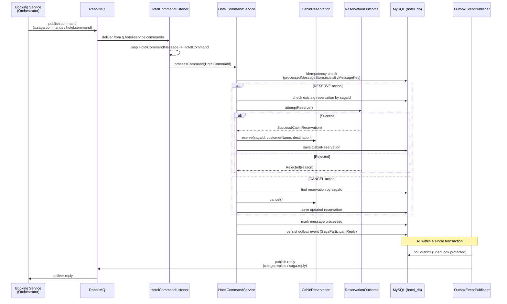
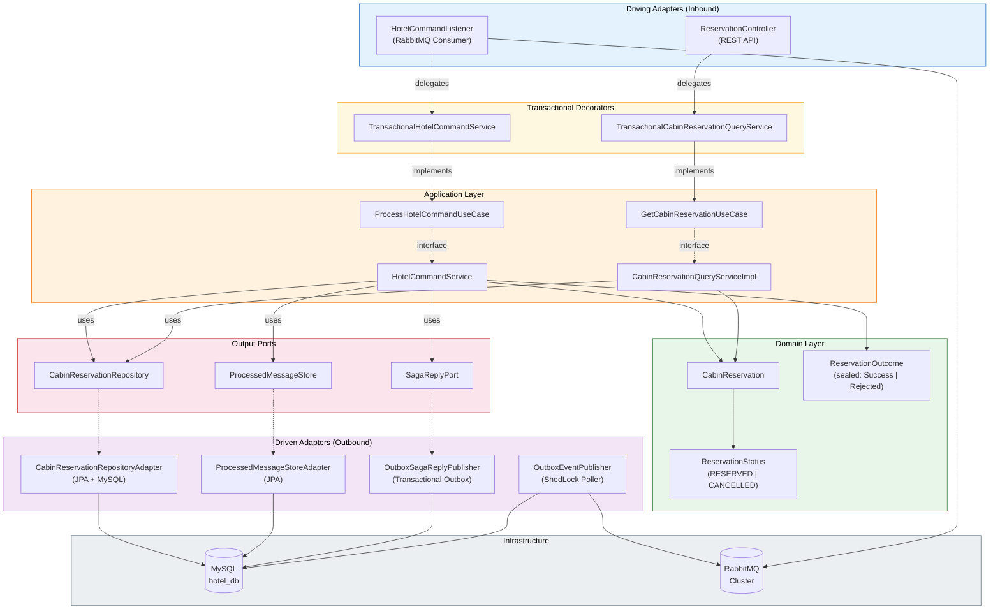

# Hotel Service

[](https://spring.io/projects/spring-boot) [![Java](https://img.shields.io/badge/Java-25-ED8B00.svg?logo=data:image/svg+xml;base64,PHN2ZyB4bWxucz0iaHR0cDovL3d3dy53My5vcmcvMjAwMC9zdmciIHZpZXdCb3g9IjAgMCAyNCAyNCIgZmlsbD0id2hpdGUiPjxwYXRoIGQ9Ik04Ljg1MSAxOC41NnMtLjkxNy41MzQuNjUzLjcxNGMxLjkwMi4yMTggMi44NzQuMTg3IDQuOTY5LS4yMTEgMCAwIC41NTIuMzQ2IDEuMzIxLjY0Ni00LjY5OCAyLjAxMy0xMC42MzMtLjExOC02Ljk0My0xLjE0OU04LjI3NiAxNS45MzNzLTEuMDI4Ljc2Mi41NDIuOTI0YzIuMDMyLjIwOSAzLjYzNi4yMjcgNi40MTMtLjMwOCAwIDAgLjM4NC4zODkuOTg3LjYwMi01LjY3OSAxLjY2MS0xMi4wMDcuMTMtNy45NDItMS4yMThNMTMuMTE2IDExLjQ3NWMxLjE1OCAxLjMzMy0uMzA0IDIuNTMzLS4zMDQgMi41MzNzMi45MzktMS41MTggMS41ODktMy40MThjLTEuMjYxLTEuNzcyLTIuMjI4LTIuNjUyIDMuMDA3LTUuNjg4IDAgMC04LjIxNiAyLjA1MS00LjI5MiA2LjU3M00xOS4zMyAyMC41MDRzLjY3OS41NTktLjc0Ny45OTFjLTIuNzEyLjgyMi0xMS4yODggMS4wNjktMTMuNjY5LjAzMy0uODU2LS4zNzMuNzUtLjg5IDEuMjU0LS45OTguNTI3LS4xMTQuODI4LS4wOTMuODI4LS4wOTMtLjk1My0uNjcxLTYuMTU2IDEuMzE3LTIuNjQzIDEuODg3IDkuNTggMS41NTMgMTcuNDYyLS43IDE0Ljk3NS0xLjgyTTkuMjkyIDEzLjIxcy00LjM2MiAxLjAzNi0xLjU0NCAxLjQxMmMxLjE4OS4xNTkgMy41NjEuMTIzIDUuNzctLjA2MiAxLjgwNi0uMTUyIDMuNjE4LS40NzcgMy42MTgtLjQ3N3MtLjYzNy4yNzItMS4wOTguNTg3Yy00LjQyOSAxLjE2NS0xMi45ODYuNjIzLTEwLjUyMi0uNTY5IDIuMDgyLTEuMDA2IDMuNzc2LS44OTEgMy43NzYtLjg5MU0xNy4xMTYgMTcuNTg0YzQuNTAzLTIuMzQgMi40MjEtNC41ODkuOTY4LTQuMjg1LS4zNTUuMDc0LS41MTUuMTM4LS41MTUuMTM4cy4xMzItLjIwNy4zODUtLjI5N2MyLjg3NS0xLjAxMSA1LjA4NiAyLjk4MS0uOTI5IDQuNTYyIDAgMCAuMDctLjA2Mi4wOTEtLjExOE0xNC40MDEgMHMyLjQ5NCAyLjQ5NC0yLjM2NSA2LjMzYy0zLjg5NiAzLjA3Ny0uODg5IDQuODMyIDAgNi44MzYtMi4yNzQtMi4wNTMtMy45NDMtMy44NTgtMi44MjQtNS41NCAxLjY0NC0yLjQ2OSA2LjE5Ny0zLjY2NSA1LjE4OS03LjYyNk05LjczNCAyMy45MjRjNC4zMjIuMjc3IDEwLjk1OS0uMTU0IDExLjExNi0yLjE5OCAwIDAtLjMwMi43NzUtMy41NzIgMS4zOTEtMy42ODguNjk0LTguMjM5LjYxMy0xMC45MzcuMTY4IDAgMCAuNTUzLjQ1NyAzLjM5My42MzkiLz48L3N2Zz4K)](https://openjdk.org/) [](https://www.docker.com/) [](https://www.rabbitmq.com/) [](https://opensource.org/licenses/MIT)

**Saga participant** microservice responsible for hotel cabin reservations within the distributed trip booking system. Receives `RESERVE` and `CANCEL` commands from the [Booking Service](../booking-service) (saga orchestrator) via RabbitMQ, executes the corresponding domain logic, and publishes a reply through the **Transactional Outbox** pattern. Built with **Hexagonal Architecture**, **idempotent message processing**, and **virtual threads**.

[Back to Table of Contents](#toc)

---

<a id="toc"></a>

## Table of Contents

- [How It Works](#how-it-works)
- [API Endpoints](#api-endpoints)
- [Getting Started](#getting-started)
- [Environment Variables](#environment-variables)
- [Common Issues](#common-issues)
- [Architecture](#architecture)
- [Tech Stack](#tech-stack)
- [Testing Strategy](#testing-strategy)
- [Repository Structure](#repository-structure)
- [Contact](#contact)

---

<a id="how-it-works"></a>

## How It Works

[Back to Table of Contents](#toc)

The Hotel Service is a **saga participant** that handles hotel cabin reservations as part of a multi-step trip booking saga. The saga orchestrator (Booking Service) sends commands, and this service processes them and replies with the outcome.

### Command Processing Lifecycle

1. **Message arrives** -- `HotelCommandListener` receives an AMQP message from `q.hotel-service.commands` and maps the `HotelCommandMessage` DTO into an internal `HotelCommand`.
2. **Idempotency check** -- `HotelCommandService` verifies the message has not been processed before by checking the `ProcessedMessageStore` with a composite key of `sagaId:action`.
3. **Domain logic** --
   - **RESERVE**: Checks whether a reservation already exists for the saga. Calls `ReservationOutcome.attemptReserve()` which returns a sealed interface (`Success` or `Rejected`). On success, the `CabinReservation` is persisted.
   - **CANCEL**: Looks up the existing reservation by saga ID, calls `cancel()` on the domain object, and saves the updated state.
4. **Mark processed** -- The message key is recorded in the processed message store to prevent duplicate handling.
5. **Publish reply** -- A `SagaParticipantReply` is published via `SagaReplyPort`, which delegates to the `OutboxSagaReplyPublisher`. The reply is persisted as an outbox event within the same transaction.
6. **Outbox polling** -- `OutboxEventPublisher` (ShedLock-protected) periodically polls the outbox table and publishes pending events to `x.saga.replies` with routing key `saga.reply`.

### Dead Letter Handling

Messages that exhaust retry attempts (5 retries, 2s initial interval, x2 multiplier) are routed to `q.hotel-service.commands.dlq` via the dead-letter exchange `x.saga.dlx`.

### Sequence Diagram



---

<a id="api-endpoints"></a>

## API Endpoints

[Back to Table of Contents](#toc)

The Hotel Service exposes a read-only REST API for querying cabin reservation state. All write operations are triggered exclusively through AMQP commands from the saga orchestrator.

### Reservations

| Method | Endpoint                 | Description                      | Response     |
|--------|--------------------------|----------------------------------|--------------|
| GET    | `/reservations`          | List all cabin reservations      | `200 OK`     |
| GET    | `/reservations/{sagaId}` | Get cabin reservation by saga ID | `200 OK` / `404 Not Found` |

### Health

| Method | Endpoint           | Description  | Response |
|--------|--------------------|--------------|----------|
| GET    | `/actuator/health` | Health check | `200 OK` |

### Example Responses

**GET /reservations**

```json
[
  {
    "id": "a1b2c3d4-e5f6-7890-abcd-ef1234567890",
    "sagaId": "f47ac10b-58cc-4372-a567-0e02b2c3d479",
    "customerName": "Jan Kowalski",
    "destination": "Zakopane",
    "status": "RESERVED",
    "createdAt": "2026-07-12T10:30:00"
  }
]
```

**GET /reservations/{sagaId}**

```json
{
  "id": "a1b2c3d4-e5f6-7890-abcd-ef1234567890",
  "sagaId": "f47ac10b-58cc-4372-a567-0e02b2c3d479",
  "customerName": "Jan Kowalski",
  "destination": "Zakopane",
  "status": "RESERVED",
  "createdAt": "2026-07-12T10:30:00"
}
```

---

<a id="getting-started"></a>

## Getting Started

[Back to Table of Contents](#toc)

### Prerequisites

- **Java 25** (JDK)
- **Maven 3.9+**
- **Docker** & **Docker Compose**
- Running instances of **MySQL** and **RabbitMQ** (provided by the root `docker-compose.yml`)

### Run with Docker Compose (recommended)

From the repository root:

```bash
docker compose up --build hotel-service
```

This starts the Hotel Service along with its MySQL database and the RabbitMQ cluster.

### Run Standalone

1. **Start dependencies** (MySQL on port 3309, RabbitMQ):

```bash
docker compose up mysql-hotel rabbitmq-node-1
```

2. **Build and run**:

```bash
cd hotel-service
mvn clean package -DskipTests
java -jar target/*.jar
```

The service starts on **port 8082** by default.

### Build Docker Image

```bash
cd hotel-service
docker build -t hotel-service:latest .
```

The Dockerfile uses a multi-stage build with Spring Boot CDS extraction (Maven build + JRE runtime), runs as a non-root user, and configures container-aware JVM settings (`-XX:+UseContainerSupport`, `-XX:MaxRAMPercentage=75.0`, `-XX:+UseG1GC`, `-XX:+ExitOnOutOfMemoryError`).

---

<a id="environment-variables"></a>

## Environment Variables

[Back to Table of Contents](#toc)

### Application

| Variable                     | Description                      | Default / Example                                      |
|------------------------------|----------------------------------|--------------------------------------------------------|
| `SERVER_PORT`                | HTTP server port                 | `8082`                                                 |
| `SPRING_APPLICATION_NAME`    | Spring application name          | `hotel-service`                                        |
| `SPRING_DATASOURCE_URL`      | JDBC connection URL              | `jdbc:mysql://localhost:3309/hotel_db`                  |
| `SPRING_DATASOURCE_USERNAME` | Database username                | `hotel_user`                                           |
| `SPRING_DATASOURCE_PASSWORD` | Database password                | `hotel_pass`                                           |

### RabbitMQ

| Variable                       | Description                | Default / Example                                    |
|--------------------------------|----------------------------|------------------------------------------------------|
| `SPRING_RABBITMQ_ADDRESSES`    | RabbitMQ node addresses    | `amqp://rabbitmq-node-1:5672`                        |
| `SPRING_RABBITMQ_USERNAME`     | RabbitMQ username          | `guest`                                              |
| `SPRING_RABBITMQ_PASSWORD`     | RabbitMQ password          | `guest`                                              |
| `SPRING_RABBITMQ_VIRTUAL_HOST` | RabbitMQ virtual host      | `/`                                                  |

### MySQL Container

| Variable                          | Description            | Default / Example |
|-----------------------------------|------------------------|-------------------|
| `HOTEL_SERVICE_MYSQL_DB_HOST`     | MySQL host             | `mysql-hotel`     |
| `HOTEL_SERVICE_MYSQL_DB_PORT`     | MySQL port             | `3309`            |
| `HOTEL_SERVICE_MYSQL_DB_NAME`     | Database name          | `hotel_db`        |
| `HOTEL_SERVICE_MYSQL_DB_USER`     | Database user          | `hotel_user`      |
| `HOTEL_SERVICE_MYSQL_DB_PASSWORD` | Database password      | `hotel_pass`      |
| `HOTEL_SERVICE_MYSQL_DB_ROOT_PASSWORD` | MySQL root password | `root_pass`      |

---

<a id="common-issues"></a>

## Common Issues

[Back to Table of Contents](#toc)

| Problem | Cause | Solution |
|---------|-------|----------|
| `Connection refused` on port 3309 | MySQL container not running | Run `docker compose up mysql-hotel` first |
| `Queue not found: q.hotel-service.commands` | RabbitMQ topology not declared | Ensure RabbitMQ is running; `HotelTopologyConfig` auto-declares queues on startup |
| Duplicate reservation log warnings | Idempotent consumer rejecting redelivered message | Normal behavior -- `ProcessedMessageStoreAdapter` prevents duplicate processing |
| `OutboxSerializationException` | Outbox event serialization failure | Check that `SagaParticipantReply` is serializable by Jackson |
| Service starts but no messages processed | Prefetch exhausted or consumer not registered | Verify RabbitMQ credentials and that `@RabbitListener` beans are active |
| `HikariPool` connection timeout | Pool exhausted (max 20) | Check for long-running transactions; increase `maximum-pool-size` if needed |
| Health check failing in Docker | Service not ready within `start-period` (60s) | Increase `HEALTHCHECK --start-period` or check MySQL connectivity |

---

<a id="architecture"></a>

## Architecture

[Back to Table of Contents](#toc)

The Hotel Service follows **Hexagonal Architecture** (Ports & Adapters), keeping domain logic independent of infrastructure concerns.



### Key Design Decisions

- **Sealed interface `ReservationOutcome`** -- Models the result of a reservation attempt as `Success(CabinReservation)` or `Rejected(String reason)`. Pattern matching in the service layer eliminates conditional branching.
- **Transactional Outbox** -- Saga replies are persisted in the same database transaction as domain state changes, then published asynchronously by `OutboxEventPublisher` with ShedLock-based distributed locking.
- **Idempotent consumers** -- Every incoming command is deduplicated using a composite key (`sagaId:action`) stored in the `ProcessedMessageStore`.
- **Transactional decorators** -- `TransactionalHotelCommandService` and `TransactionalCabinReservationQueryService` wrap use-case implementations with `@Transactional` boundaries, keeping transaction management out of the domain layer.
- **Outbox events use `Propagation.MANDATORY`** -- `OutboxEventService` requires an existing transaction, ensuring outbox writes never happen outside a transactional context.

---

<a id="tech-stack"></a>

## Tech Stack

[Back to Table of Contents](#toc)

| Technology       | Version  | Purpose                                      |
|------------------|----------|----------------------------------------------|
| Java             | 25       | Language runtime with virtual threads         |
| Spring Boot      | 4.1.0    | Application framework                        |
| Spring AMQP      | --       | RabbitMQ messaging integration               |
| Spring Data JPA  | --       | Data persistence abstraction                 |
| MySQL            | 8+       | Relational database                          |
| RabbitMQ         | 3.13+    | Message broker (quorum queues)               |
| ShedLock         | 6.0.2    | Distributed lock for outbox polling          |
| Lombok           | --       | Boilerplate reduction                        |
| Jackson          | --       | JSON serialization / deserialization         |
| JUnit 5          | --       | Unit testing framework                       |
| Mockito          | --       | Mocking framework                            |
| Docker           | --       | Containerization (multi-stage build)         |
| HikariCP         | --       | JDBC connection pooling (pool size 20)       |
| Migrations       | Liquibase  | Database schema management (changelogs)  |
| Validation       | Spring Boot Starter Validation | -- | Bean validation (Hibernate Validator) |
| Contract Testing | Spring Cloud Contract | 2025.1.0 | Stub provider for saga reply contracts |
| Code Coverage    | JaCoCo     | 0.8.13   | 80% line coverage gate                   |

---

<a id="testing-strategy"></a>

## Testing Strategy

[Back to Table of Contents](#toc)

Tests include **unit tests** (JUnit 5 + Mockito), **contract tests** (Spring Cloud Contract 2025.1.0), and **JaCoCo** enforces 80% line coverage. Each layer of the hexagonal architecture is tested in isolation through mocked port interfaces.

### Domain Layer Tests

| Test Class                | Coverage                                                      |
|---------------------------|---------------------------------------------------------------|
| `CabinReservationTest`    | Domain model: `reserve()`, `cancel()`, `restore()` lifecycle  |
| `ReservationOutcomeTest`  | Sealed interface: `attemptReserve()` success/rejection scenarios |

### Application Layer Tests

| Test Class                           | Coverage                                                           |
|--------------------------------------|--------------------------------------------------------------------|
| `HotelCommandServiceTest`            | Reserve (new, idempotent, rejected), cancel (existing, missing), duplicate skip, reply publishing |
| `CabinReservationQueryServiceImplTest` | `listAll()`, `getBySagaId()` query operations                    |
| `CabinReservationDtoTest`            | DTO construction and field mapping                                 |
| `CommandResultTest`                  | `success()` / `failure()` factory methods                          |
| `SagaParticipantReplyTest`           | Reply construction and field validation                            |

### Infrastructure Layer Tests

| Test Class                              | Coverage                                           |
|-----------------------------------------|----------------------------------------------------|
| `HotelCommandListenerTest`              | AMQP message deserialization and command mapping    |
| `OutboxSagaReplyPublisherTest`          | Outbox-based reply publishing                      |
| `OutboxEventEntityTest`                 | Entity construction and field mapping               |
| `OutboxEventPublisherTest`              | ShedLock-protected outbox poller                    |
| `OutboxEventServiceTest`                | Outbox event persistence (`Propagation.MANDATORY`)  |
| `ProcessedMessageStoreAdapterTest`      | Idempotency store operations                       |
| `CabinReservationRepositoryAdapterTest` | JPA persistence adapter                            |
| `CabinReservationMapperTest`            | Entity-to-domain and domain-to-entity mapping       |
| `TransactionalHotelCommandServiceTest`  | Transactional decorator for command processing      |
| `TransactionalCabinReservationQueryServiceTest` | Transactional decorator for query operations |

### Presentation Layer Tests

| Test Class                        | Coverage                                    |
|-----------------------------------|---------------------------------------------|
| `ReservationControllerTest`       | REST endpoint request/response handling     |
| `CabinReservationResponseDtoTest` | Response DTO construction and mapping       |
| `GlobalExceptionHandlerTest`      | Exception-to-ProblemDetail (RFC 9457) mapping |

### Contract Tests (Spring Cloud Contract)

This service is the **stub provider** -- it publishes reply messages consumed by the saga orchestrator (booking-service).

| Test Class                    | Coverage                                                  |
|-------------------------------|-----------------------------------------------------------|
| `MessagingContractBaseTest`   | Base class providing trigger methods for contract stubs   |
| `ReplyMessageContractTest`    | Reply message JSON serialization/deserialization contracts |

### Running Tests

```bash
cd hotel-service
mvn test
```

---

<a id="repository-structure"></a>

## Repository Structure

[Back to Table of Contents](#toc)

```
hotel-service/
├── src/
│   ├── main/java/com/rzodeczko/
│   │   ├── HotelServiceApplication.java
│   │   ├── application/
│   │   │   ├── command/                    # HotelCommand
│   │   │   ├── dto/                        # CabinReservationDto
│   │   │   ├── event/                      # CommandResult, SagaAction, SagaParticipantReply
│   │   │   ├── port/
│   │   │   │   ├── in/                     # ProcessHotelCommandUseCase, GetCabinReservationUseCase
│   │   │   │   └── out/                    # SagaReplyPort, CabinReservationRepository, ProcessedMessageStore
│   │   │   └── service/                    # HotelCommandService, CabinReservationQueryServiceImpl
│   │   ├── domain/
│   │   │   └── model/                      # CabinReservation, ReservationOutcome, ReservationStatus
│   │   ├── infrastructure/
│   │   │   ├── configuration/              # BeanConfiguration
│   │   │   ├── idempotency/                # ProcessedMessageEntity, JpaProcessedMessageRepository,
│   │   │   │                               #   ProcessedMessageStoreAdapter
│   │   │   ├── messaging/                  # HotelCommandListener, OutboxSagaReplyPublisher,
│   │   │   │   │                           #   HotelTopologyConfig, ParticipantTopologyProperties,
│   │   │   │   │                           #   RabbitMqConfig
│   │   │   │   └── dto/                    # HotelCommandMessage, SagaReplyMessage
│   │   │   ├── outbox/                     # OutboxEventEntity, JpaOutboxEventRepository,
│   │   │   │                               #   OutboxEventPublisher, OutboxEventService,
│   │   │   │                               #   OutboxSerializationException
│   │   │   ├── persistence/
│   │   │   │   ├── adapter/                # CabinReservationRepositoryAdapter
│   │   │   │   ├── entity/                 # CabinReservationEntity
│   │   │   │   ├── mapper/                 # CabinReservationMapper
│   │   │   │   └── repository/             # JpaCabinReservationRepository
│   │   │   └── tx/                         # TransactionalHotelCommandService,
│   │   │                                   #   TransactionalCabinReservationQueryService
│   │   └── presentation/
│   │       ├── controller/                 # ReservationController
│   │       ├── dto/
│   │       │   └── response/               # CabinReservationResponseDto
│   │       └── exception/                  # GlobalExceptionHandler
│   ├── main/resources/
│   │   ├── application.yaml                # Spring Boot configuration
│   │   └── db/changelog/
│   │       ├── db.changelog-master.yaml
│   │       └── changes/
│   │           ├── 001-create-cabin-reservations-table.yaml
│   │           ├── 002-create-processed-messages-table.yaml
│   │           ├── 003-create-outbox-events-table.yaml
│   │           └── 004-create-shedlock-table.yaml
│   └── test/java/com/rzodeczko/           # Unit tests (JUnit 5 + Mockito)
├── Dockerfile                              # Multi-stage build (Maven + JRE)
└── pom.xml                                 # Maven project descriptor
```

---

<a id="contact"></a>

## Contact

[Back to Table of Contents](#toc)

Designed and implemented by **Michal Rzodeczko**.
GitHub: [mrzodeczko-dev](https://github.com/mrzodeczko-dev)
