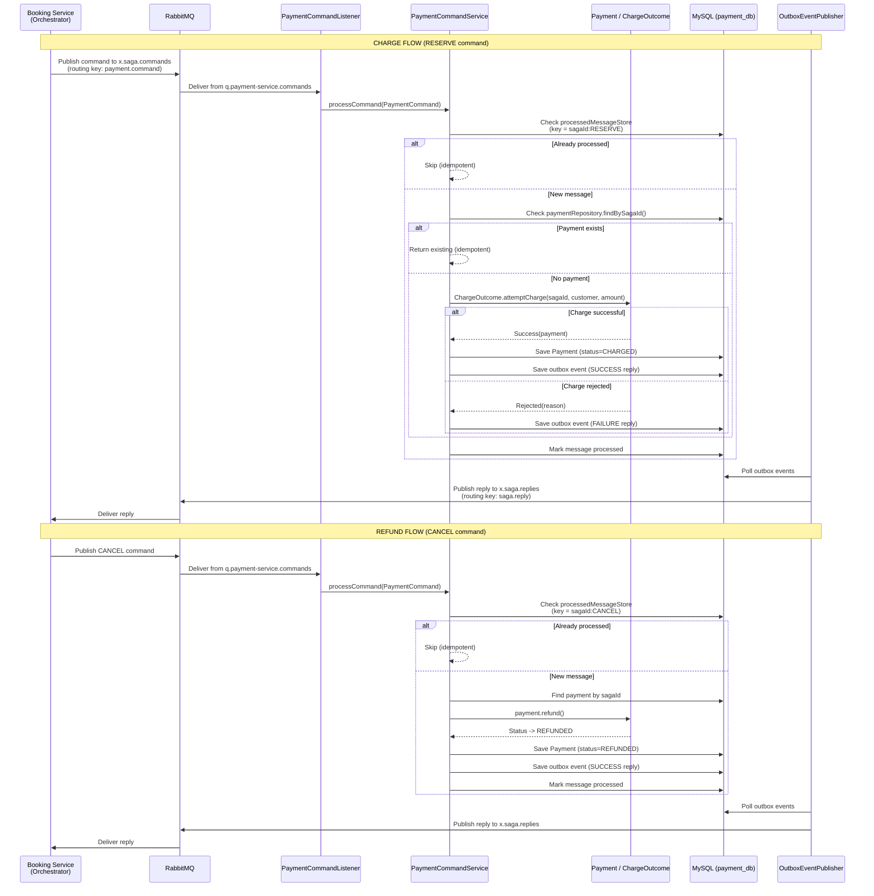
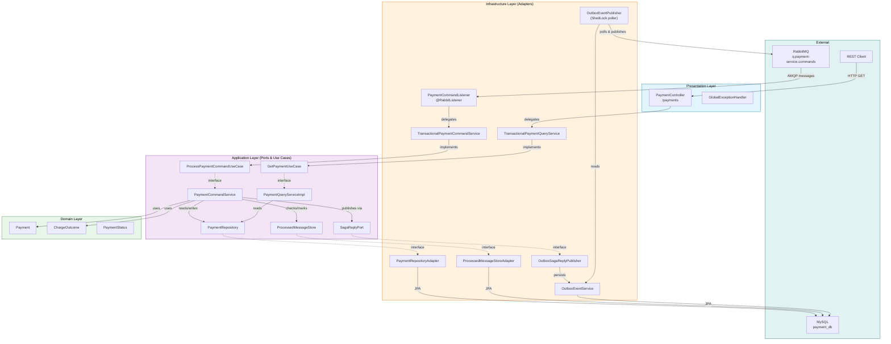

# Payment Service

[](https://spring.io/projects/spring-boot) [![Java](https://img.shields.io/badge/Java-25-ED8B00.svg?logo=data:image/svg+xml;base64,PHN2ZyB4bWxucz0iaHR0cDovL3d3dy53My5vcmcvMjAwMC9zdmciIHZpZXdCb3g9IjAgMCAyNCAyNCIgZmlsbD0id2hpdGUiPjxwYXRoIGQ9Ik04Ljg1MSAxOC41NnMtLjkxNy41MzQuNjUzLjcxNGMxLjkwMi4yMTggMi44NzQuMTg3IDQuOTY5LS4yMTEgMCAwIC41NTIuMzQ2IDEuMzIxLjY0Ni00LjY5OCAyLjAxMy0xMC42MzMtLjExOC02Ljk0My0xLjE0OU04LjI3NiAxNS45MzNzLTEuMDI4Ljc2Mi41NDIuOTI0YzIuMDMyLjIwOSAzLjYzNi4yMjcgNi40MTMtLjMwOCAwIDAgLjM4NC4zODkuOTg3LjYwMi01LjY3OSAxLjY2MS0xMi4wMDcuMTMtNy45NDItMS4yMThNMTMuMTE2IDExLjQ3NWMxLjE1OCAxLjMzMy0uMzA0IDIuNTMzLS4zMDQgMi41MzNzMi45MzktMS41MTggMS41ODktMy40MThjLTEuMjYxLTEuNzcyLTIuMjI4LTIuNjUyIDMuMDA3LTUuNjg4IDAgMC04LjIxNiAyLjA1MS00LjI5MiA2LjU3M00xOS4zMyAyMC41MDRzLjY3OS41NTktLjc0Ny45OTFjLTIuNzEyLjgyMi0xMS4yODggMS4wNjktMTMuNjY5LjAzMy0uODU2LS4zNzMuNzUtLjg5IDEuMjU0LS45OTguNTI3LS4xMTQuODI4LS4wOTMuODI4LS4wOTMtLjk1My0uNjcxLTYuMTU2IDEuMzE3LTIuNjQzIDEuODg3IDkuNTggMS41NTMgMTcuNDYyLS43IDE0Ljk3NS0xLjgyTTkuMjkyIDEzLjIxcy00LjM2MiAxLjAzNi0xLjU0NCAxLjQxMmMxLjE4OS4xNTkgMy41NjEuMTIzIDUuNzctLjA2MiAxLjgwNi0uMTUyIDMuNjE4LS40NzcgMy42MTgtLjQ3N3MtLjYzNy4yNzItMS4wOTguNTg3Yy00LjQyOSAxLjE2NS0xMi45ODYuNjIzLTEwLjUyMi0uNTY5IDIuMDgyLTEuMDA2IDMuNzc2LS44OTEgMy43NzYtLjg5MU0xNy4xMTYgMTcuNTg0YzQuNTAzLTIuMzQgMi40MjEtNC41ODkuOTY4LTQuMjg1LS4zNTUuMDc0LS41MTUuMTM4LS41MTUuMTM4cy4xMzItLjIwNy4zODUtLjI5N2MyLjg3NS0xLjAxMSA1LjA4NiAyLjk4MS0uOTI5IDQuNTYyIDAgMCAuMDctLjA2Mi4wOTEtLjExOE0xNC40MDEgMHMyLjQ5NCAyLjQ5NC0yLjM2NSA2LjMzYy0zLjg5NiAzLjA3Ny0uODg5IDQuODMyIDAgNi44MzYtMi4yNzQtMi4wNTMtMy45NDMtMy44NTgtMi44MjQtNS41NCAxLjY0NC0yLjQ2OSA2LjE5Ny0zLjY2NSA1LjE4OS03LjYyNk05LjczNCAyMy45MjRjNC4zMjIuMjc3IDEwLjk1OS0uMTU0IDExLjExNi0yLjE5OCAwIDAtLjMwMi43NzUtMy41NzIgMS4zOTEtMy42ODguNjk0LTguMjM5LjYxMy0xMC45MzcuMTY4IDAgMCAuNTUzLjQ1NyAzLjM5My42MzkiLz48L3N2Zz4K)](https://openjdk.org/) [](https://www.docker.com/) [](https://www.rabbitmq.com/) [](https://opensource.org/licenses/MIT)

## Overview

**Payment Service** is a **saga participant** in the [Saga Orchestration](../README.md) distributed trip booking system. It handles **payment charges** and **refunds** as part of the multi-step booking saga coordinated by the Booking Service (orchestrator).

When the orchestrator dispatches a `RESERVE` command, the Payment Service **charges** the customer. When a `CANCEL` command arrives (during compensation), it **refunds** the previously charged payment. All operations are **idempotent** -- duplicate commands are safely ignored via the processed message store. Replies flow back to the orchestrator through the **Transactional Outbox** pattern, guaranteeing at-least-once delivery without distributed transactions.

The service runs on port **8083**, uses **MySQL** for persistence, communicates via **RabbitMQ**, and follows **Hexagonal Architecture** (Ports & Adapters).

[Back to Table of Contents](#toc)

---

<a id="toc"></a>

## Table of Contents

- [How It Works](#how-it-works)
- [API Endpoints](#api-endpoints)
- [Getting Started](#getting-started)
- [Environment Variables](#environment-variables)
- [Common Issues](#common-issues)
- [Architecture](#architecture)
- [Tech Stack](#tech-stack)
- [Testing Strategy](#testing-strategy)
- [Repository Structure](#repository-structure)
- [Contact](#contact)

---

## How It Works

The Payment Service participates in the saga as the **third and final step** (after Flight and Hotel). It does not initiate sagas -- it reacts to commands from the orchestrator and replies with the outcome.

### Command Lifecycle

1. **Command arrives** -- `PaymentCommandListener` receives a message from `q.payment-service.commands` via `@RabbitListener`. The incoming `PaymentCommandMessage` is mapped to a domain `PaymentCommand` and delegated to `ProcessPaymentCommandUseCase`.

2. **Idempotency check** -- `PaymentCommandService` checks `processedMessageStore.existsByMessageKey(sagaId:action)`. If the message was already processed, it is silently skipped to guarantee exactly-once semantics.

3. **Action dispatch**:
   - **`RESERVE` (charge)** -- Calls `charge()`: first checks if a payment already exists for the given `sagaId` (idempotent guard). If not, calls `ChargeOutcome.attemptCharge(sagaId, customerName, amount)`. On `Success`, the `Payment` is persisted. On `Rejected`, a failure reply is built with the rejection reason.
   - **`CANCEL` (refund)** -- Calls `refund()`: finds the existing payment by `sagaId`, calls `payment.refund()` which transitions the status from `CHARGED` to `REFUNDED`, and saves the updated entity.

4. **Mark processed** -- The message key is recorded in the processed message store to prevent reprocessing on redelivery.

5. **Publish reply** -- The result (`CommandResult.success()` or `CommandResult.failure(reason)`) is wrapped in a `SagaParticipantReply` and published via `SagaReplyPort`. The `OutboxSagaReplyPublisher` implementation persists the reply as an outbox event within the same database transaction (Propagation.MANDATORY via `OutboxEventService`).

6. **Outbox polling** -- `OutboxEventPublisher` (backed by ShedLock to prevent duplicate polling in clustered deployments) picks up unpublished outbox events and sends them to `x.saga.replies` with routing key `saga.reply`.

### Sequence Diagram



### Domain Model

- **`Payment`** -- Core domain entity: `id`, `sagaId`, `customerName`, `amount` (BigDecimal), `status` (CHARGED/REFUNDED), `createdAt`. Factory method `charge()` creates a new payment, `refund()` transitions status, `restore()` reconstitutes from persistence.
- **`ChargeOutcome`** -- Sealed interface with two variants: `Success(Payment payment)` and `Rejected(String reason)`. The static factory `attemptCharge(sagaId, customerName, amount)` encapsulates charge validation logic.
- **`PaymentStatus`** -- Enum: `CHARGED`, `REFUNDED`.

---

## API Endpoints

The Payment Service exposes a read-only REST API for querying payment state.

| Method | Endpoint | Description | Response |
|--------|----------|-------------|----------|
| `GET` | `/payments` | List all payments | `200 OK` -- array of payments |
| `GET` | `/payments/{sagaId}` | Get payment by saga ID | `200 OK` -- payment object / `404 Not Found` |
| `GET` | `/actuator/health` | Health check (Spring Actuator) | `200 OK` -- health status |

### Example: List All Payments

```bash
curl http://localhost:8083/payments
```

```json
[
  {
    "id": 1,
    "sagaId": "a1b2c3d4-e5f6-7890-abcd-ef1234567890",
    "customerName": "John Doe",
    "amount": 499.99,
    "status": "CHARGED",
    "createdAt": "2026-07-12T10:30:00"
  }
]
```

### Example: Get Payment by Saga ID

```bash
curl http://localhost:8083/payments/a1b2c3d4-e5f6-7890-abcd-ef1234567890
```

```json
{
  "id": 1,
  "sagaId": "a1b2c3d4-e5f6-7890-abcd-ef1234567890",
  "customerName": "John Doe",
  "amount": 499.99,
  "status": "CHARGED",
  "createdAt": "2026-07-12T10:30:00"
}
```

---

## Getting Started

### Prerequisites

- **Java 25** (or compatible JDK)
- **Maven 3.9+**
- **MySQL 8+** (or the Docker Compose stack)
- **RabbitMQ 3.13+** (or the Docker Compose stack)

### Run with Docker Compose (recommended)

From the project root:

```bash
docker compose up --build payment-service
```

This starts the Payment Service along with its MySQL database and RabbitMQ dependencies.

### Run Locally

1. Ensure MySQL and RabbitMQ are running and accessible.

2. Set the required environment variables (see [Environment Variables](#environment-variables)).

3. Build and run:

```bash
cd payment-service
mvn clean package -DskipTests
java -jar target/*.jar
```

### Run Tests

```bash
cd payment-service
mvn test
```

---

## Environment Variables

### Application

| Variable | Description | Default / Example |
|----------|-------------|-------------------|
| `SERVER_PORT` | HTTP server port | `8083` |
| `SPRING_APPLICATION_NAME` | Service name for discovery/logging | `payment-service` |
| `SPRING_DATASOURCE_URL` | JDBC connection URL | `jdbc:mysql://localhost:3310/payment_db` |
| `SPRING_DATASOURCE_USERNAME` | Database username | `payment_user` |
| `SPRING_DATASOURCE_PASSWORD` | Database password | `payment_pass` |
| `SPRING_RABBITMQ_ADDRESSES` | RabbitMQ node addresses | `amqp://rabbit1:5672,amqp://rabbit2:5672,amqp://rabbit3:5672` |
| `SPRING_RABBITMQ_USERNAME` | RabbitMQ username | `guest` |
| `SPRING_RABBITMQ_PASSWORD` | RabbitMQ password | `guest` |
| `SPRING_RABBITMQ_VIRTUAL_HOST` | RabbitMQ virtual host | `/` |

### MySQL Container (Docker Compose)

| Variable | Description | Default / Example |
|----------|-------------|-------------------|
| `PAYMENT_SERVICE_MYSQL_DB_HOST` | MySQL host | `payment-mysql` |
| `PAYMENT_SERVICE_MYSQL_DB_PORT` | MySQL port | `3310` |
| `PAYMENT_SERVICE_MYSQL_DB_NAME` | Database name | `payment_db` |
| `PAYMENT_SERVICE_MYSQL_DB_USER` | Database user | `payment_user` |
| `PAYMENT_SERVICE_MYSQL_DB_PASSWORD` | Database password | `payment_pass` |
| `PAYMENT_SERVICE_MYSQL_DB_ROOT_PASSWORD` | MySQL root password | `root_pass` |

---

## Common Issues

| Problem | Cause | Solution |
|---------|-------|----------|
| `Connection refused` on port 3310 | MySQL not running or not reachable | Start MySQL via Docker Compose or verify host/port |
| `Queue not found: q.payment-service.commands` | RabbitMQ topology not declared | Ensure `PaymentTopologyConfig` bean is loaded; check RabbitMQ is running |
| Duplicate charges | Idempotency store not persisted | Verify MySQL is accessible; `processedMessageStore` requires a working database |
| Messages going to DLQ | Consumer throwing unrecoverable exceptions | Check logs for root cause; messages are sent to `q.payment-service.commands.dlq` after 5 retry attempts |
| `HikariPool-1 - Connection is not available` | Connection pool exhausted | Check for long-running transactions; pool size is 20 (configurable via `spring.datasource.hikari.maximum-pool-size`) |
| Outbox events not published | ShedLock conflict or poller not running | Verify ShedLock table exists; check `OutboxEventPublisher` logs; poll interval is 1000ms |
| `ChargeOutcome.Rejected` reply | Payment charge validation failed | Inspect rejection reason in the saga reply; check `ChargeOutcome.attemptCharge()` logic |

---

## Architecture

The Payment Service follows **Hexagonal Architecture** (Ports & Adapters), cleanly separating domain logic from infrastructure concerns.



### Layer Responsibilities

| Layer | Responsibility | Key Classes |
|-------|---------------|-------------|
| **Domain** | Core business logic, entities, value objects | `Payment`, `ChargeOutcome`, `PaymentStatus` |
| **Application** | Use cases, ports (interfaces), DTOs, orchestration | `PaymentCommandService`, `PaymentQueryServiceImpl`, `ProcessPaymentCommandUseCase`, `GetPaymentUseCase`, `SagaReplyPort`, `PaymentRepository`, `ProcessedMessageStore` |
| **Infrastructure** | Adapters for messaging, persistence, outbox, idempotency, transactions | `PaymentCommandListener`, `OutboxSagaReplyPublisher`, `PaymentRepositoryAdapter`, `ProcessedMessageStoreAdapter`, `OutboxEventPublisher`, `OutboxEventService`, `TransactionalPaymentCommandService`, `TransactionalPaymentQueryService` |
| **Presentation** | REST controllers, response DTOs, exception handling | `PaymentController`, `PaymentResponseDto`, `GlobalExceptionHandler` |

### Ports

**Inbound (Driving):**

| Port | Implementation | Purpose |
|------|---------------|---------|
| `ProcessPaymentCommandUseCase` | `PaymentCommandService` | Process charge/refund commands from the orchestrator |
| `GetPaymentUseCase` | `PaymentQueryServiceImpl` | Query payment state via REST |

**Outbound (Driven):**

| Port | Implementation | Purpose |
|------|---------------|---------|
| `SagaReplyPort` | `OutboxSagaReplyPublisher` | Publish saga replies via the transactional outbox |
| `PaymentRepository` | `PaymentRepositoryAdapter` | Persist and retrieve `Payment` entities |
| `ProcessedMessageStore` | `ProcessedMessageStoreAdapter` | Track processed messages for idempotency |

### Messaging Topology

| Component | Name | Purpose |
|-----------|------|---------|
| **Command Exchange** | `x.saga.commands` | Receives commands from the orchestrator |
| **Command Queue** | `q.payment-service.commands` | Payment commands (routing key: `payment.command`) |
| **Reply Exchange** | `x.saga.replies` | Outbound replies to the orchestrator |
| **Reply Routing Key** | `saga.reply` | Routing key for all participant replies |
| **DLX Exchange** | `x.saga.dlx` | Dead-letter exchange for failed messages |
| **DLQ** | `q.payment-service.commands.dlq` | Dead-letter queue (routing key: `payment.command.dlq`) |

### Reliability Features

- **Publisher confirms** (`publisher-confirm-type: correlated`) -- RabbitMQ acknowledges receipt of published messages
- **Publisher returns** (`publisher-returns: true`, `mandatory: true`) -- Unroutable messages are returned to the publisher
- **Consumer retry** -- 5 attempts, 2s initial interval, x2 multiplier, exponential backoff
- **Prefetch** -- 10 messages per consumer for controlled throughput
- **DLQ** -- Failed messages (after all retries) are routed to the dead-letter queue
- **Transactional Outbox** -- Replies are persisted in the same DB transaction as state changes
- **ShedLock** -- Prevents concurrent outbox polling in multi-instance deployments
- **Idempotent consumer** -- Duplicate messages are detected and skipped

---

## Tech Stack

| Technology | Version | Purpose |
|------------|---------|---------|
| Java | 25 | Language runtime with virtual threads |
| Spring Boot | 4.1.0 | Application framework |
| Spring AMQP | -- | RabbitMQ integration |
| Spring Data JPA | -- | Database access (Hibernate + HikariCP) |
| MySQL | 8+ | Relational database |
| RabbitMQ | 3.13+ | Message broker (quorum queues) |
| ShedLock | 6.0.2 | Distributed lock for outbox polling |
| Lombok | -- | Boilerplate reduction |
| Jackson | -- | JSON serialization/deserialization |
| JUnit 5 | -- | Unit testing framework |
| Mockito | -- | Mocking framework |
| Docker | -- | Containerization (multi-stage build) |
| Maven | 3.9+ | Build tool and dependency management |

---

## Testing Strategy

All tests are **unit tests** using **JUnit 5** and **Mockito**. Each architectural layer is tested in isolation with mocked dependencies.

### Domain Layer Tests

| Test Class | Coverage |
|------------|----------|
| `PaymentTest` | Domain entity: `charge()` factory, `refund()` status transition, `restore()` reconstitution |
| `ChargeOutcomeTest` | `attemptCharge()` scenarios: successful charge, rejected charge |

### Application Layer Tests

| Test Class | Coverage |
|------------|----------|
| `PaymentCommandServiceTest` | Charge (new payment, idempotent duplicate, rejected), refund (existing, missing), duplicate message skip, reply publishing |
| `PaymentQueryServiceImplTest` | `listAll()`, `getBySagaId()` queries |
| `PaymentDtoTest` | DTO mapping correctness |
| `CommandResultTest` | `success()` / `failure()` factory methods |
| `SagaParticipantReplyTest` | Reply construction and field mapping |

### Infrastructure Layer Tests

| Test Class | Coverage |
|------------|----------|
| `PaymentCommandListenerTest` | AMQP message deserialization and delegation |
| `OutboxSagaReplyPublisherTest` | Outbox-based reply publishing |
| `OutboxEventEntityTest` | Outbox entity mapping |
| `OutboxEventPublisherTest` | ShedLock poller behavior |
| `OutboxEventServiceTest` | Outbox event persistence |
| `ProcessedMessageStoreAdapterTest` | Idempotency store operations |
| `PaymentRepositoryAdapterTest` | JPA persistence adapter |
| `PaymentMapperTest` | Entity-to-domain and domain-to-entity mapping |
| `TransactionalPaymentCommandServiceTest` | Transactional decorator for command use case |
| `TransactionalPaymentQueryServiceTest` | Transactional decorator for query use case |

### Presentation Layer Tests

| Test Class | Coverage |
|------------|----------|
| `PaymentControllerTest` | REST endpoint routing, response codes, serialization |
| `PaymentResponseDtoTest` | Response DTO structure |
| `GlobalExceptionHandlerTest` | Exception-to-HTTP-response mapping |

---

## Repository Structure

```
payment-service/
├── src/
│   ├── main/java/com/rzodeczko/
│   │   ├── PaymentServiceApplication.java
│   │   ├── application/
│   │   │   ├── command/                    PaymentCommand
│   │   │   ├── dto/                        PaymentDto
│   │   │   ├── event/                      CommandResult, SagaAction, SagaParticipantReply
│   │   │   ├── port/
│   │   │   │   ├── in/                     ProcessPaymentCommandUseCase, GetPaymentUseCase
│   │   │   │   └── out/                    SagaReplyPort, PaymentRepository, ProcessedMessageStore
│   │   │   └── service/                    PaymentCommandService, PaymentQueryServiceImpl
│   │   ├── domain/
│   │   │   └── model/                      Payment, ChargeOutcome, PaymentStatus
│   │   └── infrastructure/
│   │       ├── configuration/              BeanConfiguration
│   │       ├── idempotency/                ProcessedMessageEntity, JpaProcessedMessageRepository,
│   │       │                               ProcessedMessageStoreAdapter
│   │       ├── messaging/                  PaymentCommandListener, OutboxSagaReplyPublisher,
│   │       │   │                           PaymentTopologyConfig, ParticipantTopologyProperties,
│   │       │   │                           RabbitMqConfig
│   │       │   └── dto/                    PaymentCommandMessage, SagaReplyMessage
│   │       ├── outbox/                     OutboxEventEntity, JpaOutboxEventRepository,
│   │       │                               OutboxEventPublisher, OutboxEventService,
│   │       │                               OutboxSerializationException
│   │       ├── persistence/
│   │       │   ├── adapter/                PaymentRepositoryAdapter
│   │       │   ├── entity/                 PaymentEntity
│   │       │   ├── mapper/                 PaymentMapper
│   │       │   └── repository/             JpaPaymentRepository
│   │       └── tx/                         TransactionalPaymentCommandService,
│   │                                       TransactionalPaymentQueryService
│   │   └── presentation/
│   │       ├── controller/                 PaymentController
│   │       ├── dto/
│   │       │   ├── error/                  ErrorResponseDto
│   │       │   └── response/               PaymentResponseDto
│   │       └── exception/                  GlobalExceptionHandler
│   ├── main/resources/
│   │   └── application.yaml
│   └── test/java/com/rzodeczko/
│       ├── application/
│       │   ├── service/                    PaymentCommandServiceTest, PaymentQueryServiceImplTest
│       │   ├── dto/                        PaymentDtoTest
│       │   └── event/                      CommandResultTest, SagaParticipantReplyTest
│       ├── domain/model/                   PaymentTest, ChargeOutcomeTest
│       ├── infrastructure/
│       │   ├── idempotency/                ProcessedMessageStoreAdapterTest
│       │   ├── messaging/                  PaymentCommandListenerTest, OutboxSagaReplyPublisherTest
│       │   ├── outbox/                     OutboxEventEntityTest, OutboxEventPublisherTest,
│       │   │                               OutboxEventServiceTest
│       │   ├── persistence/                PaymentRepositoryAdapterTest, PaymentMapperTest
│       │   └── tx/                         TransactionalPaymentCommandServiceTest,
│       │                                   TransactionalPaymentQueryServiceTest
│       └── presentation/
│           ├── controller/                 PaymentControllerTest
│           ├── dto/                        PaymentResponseDtoTest
│           └── exception/                  GlobalExceptionHandlerTest
├── Dockerfile
└── pom.xml
```

---

## Contact

Designed and implemented by **Michal Rzodeczko**.
GitHub: [mrzodeczko-dev](https://github.com/mrzodeczko-dev)
